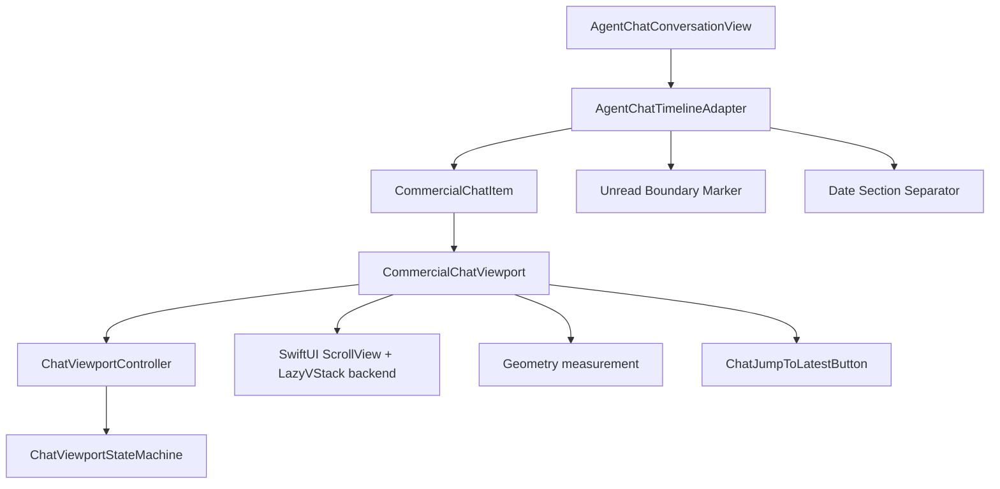

# Commercial Chat Viewport Architecture

Connor 的聊天界面不再把滚动策略直接写在 `AgentChatConversationView` 里，而是通过自研的 Chat Viewport 基础设施承载。这个模块的目标是成为 Agent 会话、未来社交聊天、消息线程、任务评论和多源事件流的共同底座。

## Why self-built

成熟聊天列表需要同时处理：

- 内容不足一屏时的 bottom anchoring；
- 用户在底部时自动跟随新消息；
- 用户阅读历史时不被新消息强制拉走；
- 跳到最新消息；
- 未来 prepend 老消息时保持阅读位置；
- 动态高度内容，例如 Markdown、附件、工具卡片；
- stable IDs、日期分隔、未读分隔、消息分组、发送状态和 read receipts。

这些行为如果散落在业务 View 中，会形成长期技术债。因此 Connor 将 viewport 逻辑抽为独立基础设施。

## Current components



### `ChatViewportStateMachine`

Pure Swift state machine. It is independent from SwiftUI and covered by unit tests.

Important modes:

- `initialBottomAnchored`
- `pinnedToBottom`
- `freeBrowsing`
- `programmaticScroll`
- `correctingAfterDataChange`

Important events:

- metrics changed;
- append/prepend/replace/height change;
- jump to latest;
- prepare for prepend;
- programmatic scroll completed.

### `ChatViewportController`

MainActor observable controller that owns:

- current `ChatViewportSnapshot`;
- pending scroll command;
- public commands like `jumpToLatest()`, `scrollToBottom()`, `scrollToItem(...)`, `prepareForPrepend(...)`.

The controller is the boundary between business state and the viewport backend.

### `CommercialChatViewport`

Reusable SwiftUI backend built with:

- `ScrollViewReader`;
- `ScrollView`;
- `LazyVStack`;
- top and bottom sentinels;
- Geometry preference measurement;
- `ChatJumpToLatestButton` overlay.

The backend does not own business semantics. Business layers notify meaningful changes through the controller.

### `AgentChatTimelineAdapter`

Converts existing `AgentChatTurnTimelineItem` into `CommercialChatItem`, preserving stable timeline IDs and assigning item kinds:

- message;
- process;
- timestamp;
- system;
- unread separator;
- date separator.

It also owns presentation-only timeline augmentation:

- optional `CommercialChatUnreadBoundary` insertion before a stable timeline item ID;
- optional date separator generation from message/timestamp dates;
- preservation of the original timeline item ordering after presentation-only markers are removed.

## Current SwiftUI backend constraints

This first commercial version intentionally keeps a SwiftUI backend because existing Agent rows are SwiftUI views and migration risk is low.

Known constraints:

- `ScrollViewReader.scrollTo` can be less precise for far-away variable-height rows in very large datasets;
- prepend correction currently provides stable anchor preservation by restoring the anchor item after a prepend; it does not guarantee pixel-perfect offset preservation for every dynamic-height row combination;
- dynamic row height changes are handled by pinned/free-browsing policy, but not with AppKit-level offset correction;
- date sections are currently rendered as stable date separator rows in the flat SwiftUI timeline. Sticky supplementary headers should be added in a backend-specific way only if they do not compromise scroll stability.

These are backend limitations, not business model limitations.

## Future AppKit backend extension

If Connor needs 10K+ variable-height social messages, precise prepend, and stronger cell reuse, add a backend behind the same controller contract.

Preferred future backend: `NSCollectionView`.

Reasons:

- ordered collection model;
- custom layout;
- multiple sections;
- supplementary views for date headers and unread separators;
- better fit for future social chat than `NSTableView`.

The business layer should not change when this backend is introduced.

## Implemented timeline capabilities

### Prepend anchor preservation

History loading must be expressed explicitly:

1. choose a stable visible anchor item ID;
2. call `prepareForPrepend(anchorItemID:)` before inserting older items;
3. notify `.prepend(...)` / `notifyPrepend(count:anchorItemID:)` after data changes;
4. allow the backend to restore the anchor item.

This keeps the logic testable and avoids the viewport guessing business events from array count changes.

### Unread boundary marker

Unread state is modeled as presentation metadata through `CommercialChatUnreadBoundary`.

Rules:

- marker IDs are derived from the target stable item ID;
- marker insertion must not mutate message IDs;
- read-state business decisions remain outside the viewport.

### Date section separator

Date grouping is owned by `AgentChatTimelineAdapter`.

Rules:

- group by calendar day using message or timestamp dates;
- process/system items without their own dates follow the nearest generated section;
- avoid duplicate separators for the same day;
- keep date separators as presentation-only items.

## Social chat roadmap

The current architecture prepares for:

- sticky date headers;
- new message notification count;
- sender grouping;
- multiple avatars;
- delivery status;
- reactions;
- replies / threads;
- read receipts;
- top pagination;
- message source badges;
- moderation/system events.

Do not add these directly to `AgentChatConversationView`. Add them as `CommercialChatItem` capabilities and viewport/controller policies.

## Design and accessibility rules

- Use `AgentChatDesignSystem` tokens for spacing and sizing.
- Pure icon buttons need accessibility labels and help text.
- Hit regions must remain at least 44×44 pt.
- Stable IDs are mandatory; never use array indices as message identity.
- Row rendering owns content; viewport owns scrolling and visibility behavior.
- Timeline markers such as unread and date separators belong in `AgentChatTimelineAdapter`, not in ad-hoc `AgentChatView` array manipulation.

## Verification

Relevant tests:

```bash
swift test --filter ChatViewportStateMachineTests
swift test --filter ChatViewportControllerTests
swift test --filter AgentChatTimelineAdapterTests
swift test --filter ConnorGraphAgentMacTests
swift test
swift build
```
