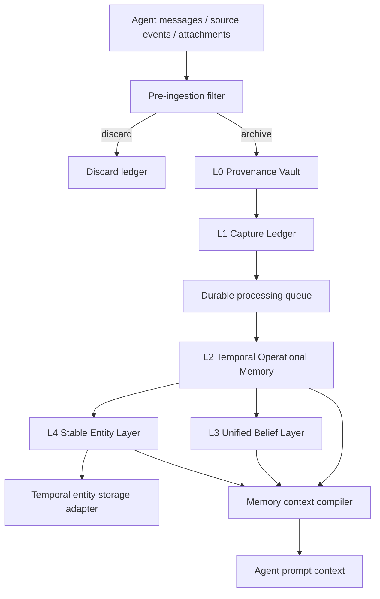

# Connor Memory OS L0-L4 Production Refactor

> Status: approved for implementation  
> Date: 2026-06-22 11:21 GMT+8  
> Branch: `feature/memory-os-l0-l4-production-refactor`

## Decision

Connor will replace the old Graph Memory pipeline with a production-grade Memory OS L0-L4 architecture.

This is a hard refactor, not an MVP and not a long-lived dual-track migration.

## What is preserved

Only the old SQLite temporal graph kernel is allowed to be migrated, and only as storage capability for L2 and L4:

- SQLite connection / transaction / migration helpers
- SQLite FTS5 usage patterns
- JSON and date persistence helpers
- temporal entity / statement modeling lessons
- stable key generation logic
- entity / statement / episode field semantics where compatible

The new primary store is `SQLiteMemoryOSStore`, not `SQLiteGraphKernelStore`.

## What is removed

H-2 completed the physical deletion/isolation pass. The following legacy concepts no longer survive as production paths:

- memory staging buffers
- memory distillation
- old LLM memory distiller
- graph extraction worker
- graph write admission policy
- optimistic graph write service
- graph admission hold queue
- graph write candidate review
- graph self-healing service
- graph extraction traces as product workflow
- graph memory change log as product workflow
- old Graph Memory dashboard panels

## Target architecture

## Production requirements

The production Memory OS must provide:

- idempotent SQLite migrations
- durable processing queue with lease, retry, and dead-letter states
- source evidence traceability from L2/L3/L4 back to L0 spans
- append-only operational and entity statements
- explicit conflict records rather than silent overwrites
- stable entity keys, aliases, merge/split events, and temporal validity
- LLM artifacts stored before normalization and validation
- schema validation and evidence validation before writes
- health checks, audit events, metrics, and recovery actions
- legacy import for existing `graph_entities`, `graph_statements`, and `graph_episodes_v3`
- UI and README that describe Memory OS, not legacy Graph Memory

## Batch strategy

Implementation is split into production batches for engineering safety, not because the product target is an MVP.

1. Phase A — production requirements, deletion checklist, legacy import plan.
2. Phase B — `SQLiteMemoryOSStore`, schema, migration, health reporting.
3. Phase C — L0-L4 domain, repositories, temporal entity kernel adapter, importer.
4. Phase D — ingestion, queue, LLM processing pipeline, validators, recovery.
5. Phase E — L2/L3/L4 production services.
6. Phase F — Agent context compiler and tools.
7. Phase G — Memory OS UI replacement.
8. Phase H — delete old Graph Memory source, schema, tests, UI.

Every completed phase must be committed independently.
