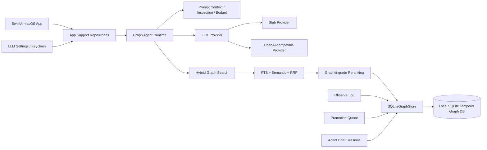
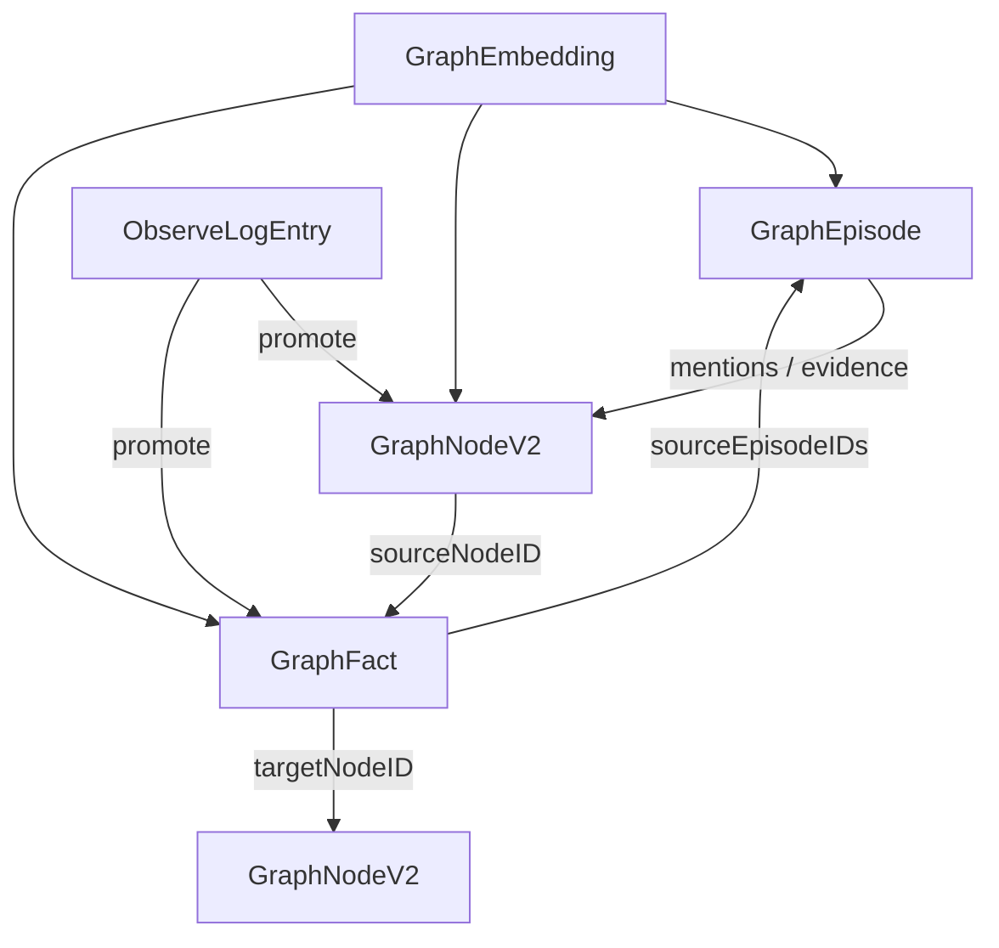
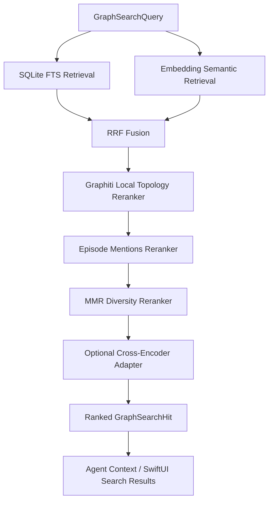

# Connor Graph Agent Mac

Connor Graph Agent Mac 是一个面向 macOS 的本地优先图谱知识 Agent 客户端。它不是 Markdown 知识库管理器，而是一个可运行的 Agent 应用原型：运行时知识源以本地 SQLite temporal graph 为准。

当前分支已经完成两项重要收敛：

1. **只保留一套图模型**：`GraphNodeV2` / `GraphFact` / `GraphEpisode`。
2. **只保留一条主检索路径**：SQLite-backed hybrid graph search。

早期简单图模型、历史 Markdown 导入链路、基于数组扫描的内存搜索索引都已移除，不再保留兼容层。

---

## 当前状态

当前代码基线处于 **temporal graph-only + SQLite-backed hybrid search-only** 阶段。

已完成并验证：

- macOS SwiftUI 应用外壳。
- SwiftPM 包结构与 Xcode macOS App 工程。
- Temporal graph 领域模型：
  - `GraphNodeV2`
  - `GraphFact`
  - `GraphEpisode`
  - `ObserveLogEntry`
- SQLite 本地图存储：`SQLiteGraphStore`。
- Graph snapshot：`GraphStoreSnapshot(graphNodes, graphFacts, graphEpisodes, observeLogEntries)`。
- SQLite-backed hybrid graph search：FTS + semantic embedding + RRF。
- Graphiti-grade 本地 reranking pipeline：
  - local graph topology boost
  - episode mentions boost
  - MMR diversity reranking
  - optional cross-encoder reranking adapter
- SQLite 图遍历层，作为 Neo4j / FalkorDB 的本地替代基座。
- Agent runtime 与 hybrid search 图上下文注入。
- Agent Chat 会话与消息持久化。
- Agent prompt inspection / prompt budget 估算。
- Agent session summary 策略与刷新状态。
- Observe Log 短期记忆与 Promotion Queue。
- Promotion Queue 统一提升到 temporal graph：
  - `candidateFact` → `GraphFact`
  - `decisionHint` → `GraphNodeV2(type: .decision)` + optional `GraphFact(.belongsTo)`
  - `userPreference` → `GraphNodeV2(type: .preference)` + `GraphFact(.hasPreference)`
- Stub LLM provider，用于本地确定性测试。
- OpenAI-compatible provider，用于真实模型调用。
- LLM Settings UI 与 macOS Keychain API key 存储。
- Provider health check / Test Connection。
- SwiftPM `swift build` 通过。

当前 shell 环境执行 `swift test` 会因缺少 Swift Testing 模块报 `no such module 'Testing'`；需要在可用 Swift Testing 的 Xcode/Swift 工具链环境下再跑全量测试。

---

## 已移除的旧系统

### 已移除：历史 Markdown 导入链路

以下内容已经从源码、Package、Xcode 工程、测试和文档中移除：

- `ConnorGraphImport`
- `LegacyMarkdownImport`
- `LegacyKnowledgeDirectoryImporter`
- `AppImportReport`
- SwiftUI 导入页面
- `importKnowledgeDirectory` / `importLegacyKnowledge` / `importReadOnlyKnowledge`
- `Tests/ConnorGraphImportTests`

Markdown 不再是运行时知识导入入口。未来如果需要 Markdown，只应作为：

- 人类可读导出投影；
- 证据或来源快照；
- 跨系统互操作格式。

### 已移除：早期简单图模型

以下旧模型和旧 API 已移除：

- `GraphNode`
- `SemanticEdge`
- `NodeStatus`
- `graph_nodes` SQLite 表
- `semantic_edges` SQLite 表
- `upsert(node:)`
- `node(id:)`
- `upsert(edge:)`
- `edge(id:)`
- `neighborhoodEdges(nodeID:)`
- `allNodes`
- `allEdges`

当前只有 temporal graph 模型，不保留 legacy compatibility layer。

---

## 产品原则

### 1. Temporal graph 是唯一运行时知识模型

运行时知识的事实来源是：

```text
SQLiteGraphStore
  ├─ GraphEpisode
  ├─ GraphNodeV2
  ├─ GraphFact
  ├─ GraphEmbedding
  ├─ ObserveLogEntry
  ├─ AgentSession
  └─ AgentMessage
```

核心对象含义：

| 对象 | 含义 |
| --- | --- |
| `GraphEpisode` | 一段被观察、摄取或记录的来源事件 / 片段 / 对话 / 外部证据。 |
| `GraphNodeV2` | 稳定实体节点，例如人、项目、问题、答案、决策、偏好、流程等。 |
| `GraphFact` | 两个节点之间带时间、置信度、状态和证据来源的事实关系。 |
| `ObserveLogEntry` | 短期观察日志，可被提升为节点或事实。 |
| `GraphEmbedding` | episode / node / fact 的向量索引载体。 |

典型映射：

```text
Question Ledger       → GraphNodeV2(type: .question)
Answer Cache          → GraphNodeV2(type: .answer)
Work Object           → GraphNodeV2(type: .workObject)
Decision              → GraphNodeV2(type: .decision)
SOP / Runbook         → GraphNodeV2(type: .procedure)
Person Profile        → GraphNodeV2(type: .person)
User Preference       → GraphNodeV2(type: .preference)
实体、项目、业务对象等 → GraphNodeV2 + GraphFact
```

### 2. SQLite 是本地 truth layer

默认行为保持 local-first：

- 本地 SQLite 是知识图谱的 truth layer。
- 默认不依赖 Neo4j / FalkorDB。
- 默认不依赖外部 reranker 服务。
- 默认不要求真实 LLM API key。
- 测试使用 Stub provider、hybrid search test doubles 与本地 SQLite，保证确定性。
- 外部模型能力通过 adapter 扩展，不成为基础搜索可用性的前提。

这意味着即使没有网络、没有 API key、没有外部向量服务，应用仍然可以启动、搜索、聊天测试和运行大部分本地功能。

### 3. 检索入口统一到 hybrid graph search

App Search 与 Agent runtime 的上下文检索入口统一走：

```text
GraphSearchQuery
→ GraphHybridSearchService
→ SQLiteGraphHybridSearchService
→ [GraphSearchHit]
```

不再使用早期 snapshot / 数组扫描 / in-memory search index。

---

## 总体架构



### 数据模型关系



### 检索与 reranking pipeline



规范执行顺序固定为：

```text
graphiti_local
→ episode_mentions
→ mmr
→ cross_encoder
```

这个顺序会写入 search hit metadata：

```text
graph_reranking_strategies = graphiti_local,episode_mentions,mmr,cross_encoder
```

调用方只消费统一的 `GraphSearchHit`。

---

## 目录结构

```text
.
├── Package.swift
├── README.md
├── ConnorGraphAgentMac.xcodeproj
├── Sources
│   ├── ConnorGraphCore
│   ├── ConnorGraphMemory
│   ├── ConnorGraphStore
│   ├── ConnorGraphSearch
│   ├── ConnorGraphAgent
│   ├── ConnorGraphAppSupport
│   └── ConnorGraphAgentMac
└── Tests
    ├── ConnorGraphCoreTests
    ├── ConnorGraphMemoryTests
    ├── ConnorGraphStoreTests
    ├── ConnorGraphSearchTests
    ├── ConnorGraphAgentTests
    └── ConnorGraphAppSupportTests
```

---

## 模块说明

### `ConnorGraphCore`

核心领域模型层。

代表文件：

```text
Sources/ConnorGraphCore/AgentConversation.swift
Sources/ConnorGraphCore/GraphDomain.swift
Sources/ConnorGraphCore/GraphTemporalDomain.swift
```

主要职责：

- 定义 Agent conversation model。
- 定义 shared graph enums：`NodeType` / `RelationType`。
- 定义 temporal graph model：`GraphEpisode` / `GraphNodeV2` / `GraphFact`。
- 定义 temporal status 与 source/status metadata。

关键概念：

```text
GraphEpisode
GraphNodeV2
GraphFact
GraphTemporalStatus
NodeType
RelationType
AgentSession
AgentMessage
```

### `ConnorGraphMemory`

短期记忆与记忆提升层。

代表文件：

```text
Sources/ConnorGraphMemory/ObserveLog.swift
Sources/ConnorGraphMemory/MemoryPromotion.swift
```

主要职责：

- Observe Log。
- 30 天滚动短期记忆策略。
- Promotion Queue。
- 将候选记忆提升为 `GraphNodeV2` 或 `GraphFact`。

Promotion 规则：

```text
candidateFact  → GraphFact draft
decisionHint   → Decision GraphNodeV2 draft + optional BELONGS_TO GraphFact
userPreference → Preference GraphNodeV2 draft + HAS_PREFERENCE GraphFact
```

### `ConnorGraphStore`

SQLite 持久化、FTS、embedding、hybrid search 和本地图遍历层。

代表文件：

```text
Sources/ConnorGraphStore/SQLiteGraphStore.swift
Sources/ConnorGraphStore/GraphStoreSnapshot.swift
Sources/ConnorGraphStore/SQLiteGraphHybridSearchService.swift
Sources/ConnorGraphStore/SQLiteGraphTraversalStore.swift
```

主要职责：

- SQLite schema migration。
- `GraphEpisode` / `GraphNodeV2` / `GraphFact` 持久化。
- `ObserveLogEntry` 持久化。
- Chat sessions/messages 持久化。
- Graph embeddings 持久化。
- FTS 查询。
- Semantic 查询。
- RRF fusion。
- Graphiti-grade reranking。
- 本地图遍历。

核心表：

```text
graph_episodes
graph_nodes_v2
graph_facts
graph_fact_episodes
graph_embeddings
observe_log_entries
chat_sessions
chat_messages
agent_session_summaries
agent_prompt_inspection_snapshots
agent_prompt_inspection_messages
agent_session_summary_refresh_states
embedding_index_tasks
```

统一写入 API：

```swift
try store.upsert(episode: episode)
try store.upsert(nodeV2: node)
try store.upsert(fact: fact, sourceEpisodeIDs: [episode.id])
```

统一读取 API：

```swift
let episode = try store.graphEpisode(id: episodeID)
let node = try store.graphNodeV2(id: nodeID)
let fact = try store.graphFact(id: factID)
```

统一 snapshot API：

```swift
let snapshot = try store.snapshot(
    graphNodeLimit: 1_000,
    graphFactLimit: 2_000,
    graphEpisodeLimit: 1_000,
    observeLogLimit: 500
)
```

### `ConnorGraphSearch`

搜索抽象层。

代表文件：

```text
Sources/ConnorGraphSearch/GraphHybridSearch.swift
```

主要职责：

- 定义 `GraphSearchQuery`。
- 定义 `GraphSearchHit`。
- 定义 `GraphHybridSearchService` 协议。
- 定义 graph context assembly 所需的 search result shape。

### `ConnorGraphAgent`

Agent runtime 层。

代表文件：

```text
Sources/ConnorGraphAgent/GraphAgentRuntime.swift
Sources/ConnorGraphAgent/AgentChatController.swift
Sources/ConnorGraphAgent/AgentChatPromptContext.swift
Sources/ConnorGraphAgent/AgentChatPromptInspection.swift
Sources/ConnorGraphAgent/AgentPromptBudgetEstimator.swift
Sources/ConnorGraphAgent/AgentSessionSummarizer.swift
Sources/ConnorGraphAgent/AgentSessionSummaryPolicy.swift
```

主要职责：

- LLM provider 抽象。
- Stub provider。
- OpenAI-compatible provider。
- Agent chat orchestration。
- Hybrid graph context 注入。
- Prompt inspection。
- Prompt budget estimate。
- Session summary refresh strategy。

### `ConnorGraphAppSupport`

App 侧 repository 和系统集成层。

代表文件：

```text
Sources/ConnorGraphAppSupport/AppGraphRepository.swift
Sources/ConnorGraphAppSupport/AppPromotionQueueRepository.swift
Sources/ConnorGraphAppSupport/AppChatSessionRepository.swift
Sources/ConnorGraphAppSupport/AppGraphAgentRuntimeFactory.swift
Sources/ConnorGraphAppSupport/AppLLMSettingsRepository.swift
Sources/ConnorGraphAppSupport/KeychainCredentialStore.swift
Sources/ConnorGraphAppSupport/AppLLMProviderHealthChecker.swift
```

主要职责：

- App storage path resolution。
- SQLite store bootstrap。
- Graph snapshot loading。
- Promotion Queue repository。
- Chat session repository。
- Agent runtime factory。
- LLM settings 持久化。
- Keychain credential storage。
- Provider health check。

### `ConnorGraphAgentMac`

SwiftUI macOS App 层。

代表文件：

```text
Sources/ConnorGraphAgentMac/ConnorGraphAgentMacApp.swift
Sources/ConnorGraphAgentMac/AgentChatView.swift
Sources/ConnorGraphAgentMac/EmptyGraphHybridSearchService.swift
```

主要职责：

- macOS App entry point。
- Sidebar navigation。
- Graph overview。
- Search UI。
- Observe Log UI。
- Promotion Queue UI。
- Agent Chat UI。
- Prompt inspection UI。
- LLM Settings UI。

---

## App 页面

当前 SwiftUI App 包含：

```text
图谱节点
搜索
Agent Chat
上下文检查
Observe Log
提升队列
模型设置
```

不再包含导入页面。

---

## 构建与运行

### SwiftPM build

```bash
cd /Users/duanshiwen/code/agent-os/agents/connor-graph-agent-mac
swift build
```

当前结果：

```text
ok (build complete)
```

### SwiftPM test

```bash
swift test
```

当前 shell 环境可能报：

```text
no such module 'Testing'
```

这是当前命令行 Swift toolchain 缺少 Swift Testing 模块导致的环境问题。需要在支持 Swift Testing 的 Xcode/Swift 工具链环境下运行。

### Xcode App

可以通过 Xcode 打开：

```text
ConnorGraphAgentMac.xcodeproj
```

App target 依赖本地 SwiftPM package products：

```text
ConnorGraphCore
ConnorGraphMemory
ConnorGraphStore
ConnorGraphSearch
ConnorGraphAgent
ConnorGraphAppSupport
```

---

## 开发约束

### 不要恢复 legacy import

不要重新引入：

```text
ConnorGraphImport
LegacyMarkdownImport
LegacyKnowledgeDirectoryImporter
AppImportReport
ImportKnowledgeView
```

如果未来需要从外部资料进入图谱，应设计新的 ingestion pipeline，直接写入 temporal graph：

```text
source artifact
→ GraphEpisode
→ GraphNodeV2 / GraphFact extraction
→ GraphEmbedding indexing
→ hybrid search
```

### 不要恢复早期简单图模型

不要重新引入：

```text
GraphNode
SemanticEdge
NodeStatus
graph_nodes
semantic_edges
```

所有节点和关系都应落到：

```text
GraphNodeV2
GraphFact
GraphEpisode
```

### 不要恢复内存搜索索引

不要重新引入：

```text
InMemoryGraphSearchIndex
GraphSearchOptions
ContextAssembler
snapshot-based array scan search
```

所有 App Search 和 Agent Context 都应走：

```text
GraphHybridSearchService
SQLiteGraphHybridSearchService
```

---

## 推荐下一步

1. 在支持 Swift Testing 的 Xcode/Swift 工具链下跑全量测试。
2. 对现有 SQLite schema 做一次 migration audit，确认历史开发库中如存在旧表，不影响新代码路径。
3. 设计新的 ingestion pipeline，但不要复活 legacy Markdown import：入口应直接产生 `GraphEpisode` / `GraphNodeV2` / `GraphFact`。
4. 为 temporal graph 加 schema/version health check，启动时明确展示当前图模型版本。
5. 为 Promotion Queue 增加人工审核 UI 的 richer diff：候选 observe log → 将要写入的 node/fact。

---

## License

This project is licensed under the MIT License. See [LICENSE](./LICENSE) for details.
