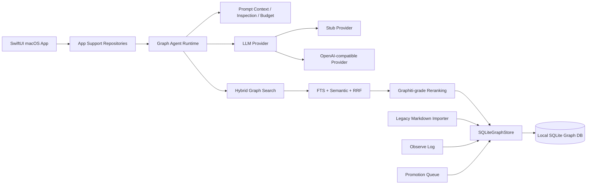

# Connor Graph Agent Mac

Connor Graph Agent Mac 是一个面向 macOS 的本地优先图谱知识 Agent 客户端。它不是 Markdown 知识库管理器，而是一个可运行的 Agent 应用原型：运行时知识源以本地 SQLite 图数据库为准，Markdown 只作为历史资料导入、证据快照或导出投影格式。

当前项目同时包含：

- SwiftPM 包，用于命令行构建、测试和模块化开发。
- Xcode macOS App 工程，用于稳定启动和调试 SwiftUI 桌面应用。
- 本地 SQLite 图存储、混合检索、Graphiti-grade reranking、Agent Chat、Observe Log、Promotion Queue、LLM 设置和 Keychain 凭据存储。

---

## 当前状态

当前主线能力已经从早期 MVP 演进到 **SQLite-backed hybrid search only 阶段**：早期基于数组扫描的简单内存搜索索引已经移除，App Search 与 Agent runtime 的上下文检索入口统一走 `GraphHybridSearchService` / `SQLiteGraphHybridSearchService`。

截至当前分支：

```text
remove-in-memory-search
```

已完成并验证：

- macOS SwiftUI 应用外壳。
- 图谱核心领域模型。
- SQLite 本地图存储。
- GraphNode / SemanticEdge / GraphFact / GraphEpisode / ObserveLogEntry 等运行时模型。
- 历史 Markdown 知识库只读导入。
- SQLite-backed hybrid graph search 与上下文组装。
- Agent runtime 与 hybrid search 图上下文注入。
- Agent Chat 会话与消息持久化。
- Agent prompt inspection / prompt budget 估算。
- Agent session summary 策略与刷新状态。
- Observe Log 短期记忆与 Promotion Queue。
- Stub LLM provider，用于本地确定性测试。
- OpenAI-compatible provider，用于真实模型调用。
- LLM Settings UI 与 macOS Keychain API key 存储。
- Provider health check / Test Connection。
- SQLite embedding 存储与语义检索。
- SQLite-backed hybrid search：FTS + semantic + RRF，是 App Search 与 Agent Context 的唯一主搜索路径。
- Graphiti-grade 本地 reranking pipeline：
  - local graph topology boost
  - episode mentions boost
  - MMR diversity reranking
  - optional cross-encoder reranking adapter
- SQLite 图遍历层，作为 Neo4j / FalkorDB 的本地替代基座。
- 简单内存搜索索引已移除：不再使用 `InMemoryGraphSearchIndex` / `GraphSearchOptions` / `ContextAssembler`。
- SwiftPM build 通过。
- 当前 shell 环境执行 `swift test` 会因缺少 Swift Testing 模块报 `no such module 'Testing'`；需要在可用 Swift Testing 的 Xcode/Swift 工具链环境下再跑全量测试。

---

## 产品原则

### Markdown 不是最终知识载体

本项目的核心原则是：**Markdown 不是运行时知识的最终载体**。

Markdown 可以作为：

- 历史知识库导入源；
- 人类可读导出投影；
- 证据或来源快照；
- 跨系统互操作格式。

但运行时知识的事实来源是：

```text
SQLiteGraphStore
  ├─ GraphNode / GraphNodeV2
  ├─ SemanticEdge
  ├─ GraphFact
  ├─ GraphEpisode
  ├─ GraphEmbedding
  ├─ ObserveLogEntry
  ├─ ChatSession
  └─ ChatMessage
```

历史知识库中的概念会映射为图原生结构：

```text
Question Ledger       → GraphNode(type: .question)
Answer Cache          → GraphNode(type: .answer)
Work Object           → GraphNode(type: .workObject)
Decision              → GraphNode(type: .decision)
SOP / Runbook         → GraphNode(type: .procedure)
Person Profile        → GraphNode(type: .person)
User Preference       → GraphNode(type: .preference)
实体、项目、业务对象等 → typed graph nodes + semantic edges
```

### Local-first 是默认策略

默认行为保持本地优先：

- 本地 SQLite 是知识图谱的 truth layer。
- 默认不依赖 Neo4j / FalkorDB。
- 默认不依赖外部 reranker 服务。
- 默认不要求真实 LLM API key。
- 测试使用 Stub provider、hybrid search test doubles 与本地 SQLite，保证确定性。
- 外部模型能力通过 adapter 扩展，不成为基础搜索可用性的前提。

这意味着即使没有网络、没有 API key、没有外部向量服务，应用仍然可以启动、导入、搜索、聊天测试和运行大部分本地功能。

---

## 总体架构



### 检索与 reranking pipeline

当前图搜索链路只有一条主路径：`GraphSearchQuery` → `GraphHybridSearchService` → `SQLiteGraphHybridSearchService` → ranked `GraphSearchHit`。早期基于 snapshot / 数组扫描的简单内存搜索已经移除，Agent context 与 SwiftUI Search 页面都不再构造内存 search index。


规范执行顺序固定为：

```text
graphiti_local
→ episode_mentions
→ mmr
→ cross_encoder
```

这个顺序会写入 metadata。调用方只消费统一的 `GraphSearchHit`，不再处理旧的 `GraphSearchResult` / `SemanticEdge` / `ObserveLogEntry` 混合枚举结果：

```text
graph_reranking_strategies = graphiti_local,episode_mentions,mmr,cross_encoder
```

---

## 目录结构

```text
.
├── Package.swift
├── README.md
├── ConnorGraphAgentMac.xcodeproj
├── Sources
│   ├── ConnorGraphCore
│   ├── ConnorGraphMemory
│   ├── ConnorGraphStore
│   ├── ConnorGraphImport
│   ├── ConnorGraphSearch
│   ├── ConnorGraphAgent
│   ├── ConnorGraphAppSupport
│   └── ConnorGraphAgentMac
└── Tests
    ├── ConnorGraphCoreTests
    ├── ConnorGraphMemoryTests
    ├── ConnorGraphStoreTests
    ├── ConnorGraphImportTests
    ├── ConnorGraphSearchTests
    ├── ConnorGraphAgentTests
    └── ConnorGraphAppSupportTests
```

---

## 模块说明

### `ConnorGraphCore`

核心领域模型层。

主要职责：

- 定义 Agent conversation model。
- 定义 graph domain model。
- 定义 temporal graph status。
- 定义语义边、节点类型、关系类型。

代表文件：

```text
Sources/ConnorGraphCore/AgentConversation.swift
Sources/ConnorGraphCore/GraphDomain.swift
Sources/ConnorGraphCore/GraphTemporalDomain.swift
```

关键概念：

```text
GraphNode
GraphNodeV2
GraphFact
GraphEpisode
SemanticEdge
GraphTemporalStatus
AgentSession
AgentMessage
```

---

### `ConnorGraphMemory`

短期记忆与记忆提升层。

主要职责：

- Observe Log。
- 30 天滚动短期记忆策略。
- Promotion Queue。
- 将候选记忆提升为图节点或图边。

代表文件：

```text
Sources/ConnorGraphMemory/ObserveLog.swift
Sources/ConnorGraphMemory/MemoryPromotion.swift
```

当前支持的 observe-log kinds：

```text
operation
toolEvent
insight
fragment
observation
candidateFact
decisionHint
userPreference
user
agent
tool
import
search
```

Promotion 行为：

```text
candidateFact  → SemanticEdge draft
decisionHint   → Decision GraphNode draft + optional BELONGS_TO edge
userPreference → Preference GraphNode draft + HAS_PREFERENCE edge
```

---

### `ConnorGraphStore`

SQLite 持久化与本地 hybrid graph search 运行时核心。

主要职责：

- SQLite schema migration。
- GraphNode / GraphNodeV2 / GraphFact / GraphEpisode 持久化。
- SemanticEdge 持久化。
- Observe Log 持久化。
- Promotion Queue 状态持久化。
- ChatSession / ChatMessage 持久化。
- GraphEmbedding 存储与 cosine search。
- FTS 索引与 embedding indexing task。
- Hybrid search service，作为 App Search 与 Agent Context 的统一检索入口。
- SQLite graph traversal substrate。

代表文件：

```text
Sources/ConnorGraphStore/SQLiteGraphStore.swift
Sources/ConnorGraphStore/SQLiteGraphHybridSearchService.swift
Sources/ConnorGraphStore/SQLiteGraphTraversalStore.swift
Sources/ConnorGraphStore/GraphStoreSnapshot.swift
```

关键 SQLite 表包括：

```text
schema_migrations
graph_nodes
graph_nodes_v2
semantic_edges
graph_facts
graph_fact_sources
graph_episodes
graph_embeddings
graph_mentions
graph_node_candidates
graph_fact_candidates
observe_log_entries
chat_sessions
chat_messages
chat_session_summaries
graph_index_tasks
graph_generation_runs
graph_jobs
graph_job_events
graph_cost_budgets
```

其中 `chat_sessions` 和 `chat_messages` 是已有聊天历史表，当前 Graphiti reranking 相关改动没有破坏它们。

---

### `ConnorGraphSearch`

搜索接口、embedding provider 协议、AgentContext 基础结构与 hybrid search 公共类型。

主要职责：

- 定义 graph search query / response / hit。
- 定义 GraphHybridSearchService 协议，作为唯一搜索服务抽象。
- 定义 EmbeddingProvider 协议。
- 定义 GraphRerankingConfig。
- 定义 GraphRerankerStrategy。
- 定义 optional cross-encoder adapter 协议。
- 定义 AgentContext / AgentContextItem，用于把 ranked GraphSearchHit 注入 Agent prompt。
- 不再包含 InMemoryGraphSearchIndex、GraphSearchOptions 或 ContextAssembler。

代表文件：

```text
Sources/ConnorGraphSearch/GraphSearch.swift
Sources/ConnorGraphSearch/GraphHybridSearch.swift
Sources/ConnorGraphSearch/EmbeddingProvider.swift
```

当前 reranking strategy：

```swift
public enum GraphRerankerStrategy: String, Sendable, Codable, Equatable {
    case graphitiLocal = "graphiti_local"
    case episodeMentions = "episode_mentions"
    case maximalMarginalRelevance = "mmr"
    case crossEncoder = "cross_encoder"
}
```

规范执行顺序：

```swift
public static let canonicalExecutionOrder: [GraphRerankerStrategy] = [
    .graphitiLocal,
    .episodeMentions,
    .maximalMarginalRelevance,
    .crossEncoder
]
```

---

### `ConnorGraphImport`

历史 Markdown 知识库只读导入层。

主要职责：

- 扫描 Markdown 文件。
- 解析 frontmatter。
- 将历史知识条目映射为图节点和语义边。
- 不修改源 Markdown 仓库。

代表文件：

```text
Sources/ConnorGraphImport/LegacyKnowledgeDirectoryImporter.swift
Sources/ConnorGraphImport/LegacyMarkdownImport.swift
```

导入报告：

```swift
LegacyDirectoryImportReport(
    scannedFiles: Int,
    importedNodes: Int,
    importedEdges: Int,
    skippedFiles: Int,
    warnings: [LegacyImportWarning]
)
```

---

### `ConnorGraphAgent`

Agent runtime、聊天控制器、Prompt 构建与 LLM provider 层。

主要职责：

- GraphAgent runtime。
- Agent Chat controller。
- 基于 GraphHybridSearchService 的 Prompt context 组装。
- Prompt inspection snapshot。
- Prompt budget 估算。
- Agent session summarizer。
- Stub LLM provider。
- OpenAI-compatible provider。

代表文件：

```text
Sources/ConnorGraphAgent/ConnorGraphAgent.swift
Sources/ConnorGraphAgent/GraphAgentRuntime.swift
Sources/ConnorGraphAgent/AgentChatController.swift
Sources/ConnorGraphAgent/AgentChatPromptContext.swift
Sources/ConnorGraphAgent/AgentChatPromptInspection.swift
Sources/ConnorGraphAgent/AgentPromptBudgetEstimator.swift
Sources/ConnorGraphAgent/AgentSessionSummarizer.swift
Sources/ConnorGraphAgent/OpenAICompatibleProvider.swift
```

---

### `ConnorGraphAppSupport`

SwiftUI App 与底层 runtime 之间的适配层。

主要职责：

- Application Support 路径管理。
- SQLite bootstrap。
- App repository。
- Chat session repository。
- Promotion queue repository。
- LLM settings repository。
- Keychain credential store。
- LLM provider health checker。
- GraphAgent runtime factory。

代表文件：

```text
Sources/ConnorGraphAppSupport/AppStoragePaths.swift
Sources/ConnorGraphAppSupport/AppGraphBootstrapper.swift
Sources/ConnorGraphAppSupport/AppGraphRepository.swift
Sources/ConnorGraphAppSupport/AppChatSessionRepository.swift
Sources/ConnorGraphAppSupport/AppLLMSettingsRepository.swift
Sources/ConnorGraphAppSupport/KeychainCredentialStore.swift
Sources/ConnorGraphAppSupport/AppLLMProviderHealthChecker.swift
Sources/ConnorGraphAppSupport/AppGraphAgentRuntimeFactory.swift
```

---

### `ConnorGraphAgentMac`

macOS SwiftUI 应用层。

主要职责：

- App entry point。
- SwiftUI 页面。
- Graph Nodes / Search / Observe Log / Agent Chat / Promotion Queue / Import / LLM Settings 等 UI。

代表文件：

```text
Sources/ConnorGraphAgentMac/ConnorGraphAgentMacApp.swift
Sources/ConnorGraphAgentMac/AgentChatView.swift
```

---

## 当前 SwiftUI 页面

应用当前包含以下主要页面：

```text
Graph Nodes       查看 SQLite 中的图节点与图边
Search            通过 SQLite-backed hybrid search 查询 ranked GraphSearchHit
Observe Log       查看短期记忆条目
Agent Chat        使用 hybrid graph context 进行 Agent 对话，会话与消息持久化到 SQLite
Promotion Queue   审核、提升、忽略、置顶记忆候选
Import            只读导入历史 Markdown 知识库
LLM Settings      配置 Stub / OpenAI-compatible provider 与 API key
```

---

## 本地运行

### SwiftPM 命令行运行

在项目根目录执行：

```bash
swift run connor-graph-agent-mac
```

如果数据库为空，应用会 seed 少量 demo graph 数据，保证没有 API key 时也能启动和浏览。

### Xcode 运行

项目包含 Xcode macOS app 工程：

```text
ConnorGraphAgentMac.xcodeproj
```

推荐通过 Xcode 运行 GUI：

1. 打开 `ConnorGraphAgentMac.xcodeproj`。
2. 选择 `ConnorGraphAgentMacApp` scheme。
3. 选择 `My Mac` destination。
4. 点击 Run。

注意：SwiftPM executable scheme `connor-graph-agent-mac` 可能只构建为普通可执行文件，而不是 `.app` bundle。GUI 调试请使用 `ConnorGraphAgentMacApp`。

---

## 测试与构建

由于本机默认 `xcode-select` 可能指向 CommandLineTools，建议显式使用完整 Xcode toolchain：

```bash
DEVELOPER_DIR=/Applications/Xcode.app/Contents/Developer swift test
DEVELOPER_DIR=/Applications/Xcode.app/Contents/Developer swift build
```

Xcode app scheme 构建：

```bash
DEVELOPER_DIR=/Applications/Xcode.app/Contents/Developer xcodebuild \
  -project ConnorGraphAgentMac.xcodeproj \
  -scheme ConnorGraphAgentMacApp \
  -destination 'platform=macOS,arch=arm64' \
  build
```

当前分支验证状态：

```text
swift build: Build complete
swift test: 当前 shell 环境缺少 Swift Testing 模块，报 no such module 'Testing'
xcodebuild: 待在 Xcode toolchain 环境复跑
```

---

## 应用数据库

SwiftUI App 的运行时 SQLite 数据库默认位于：

```text
~/Library/Application Support/ConnorGraphAgent/connor-graph.sqlite
```

启动流程：

```text
1. 解析 Application Support 目录
2. 创建 ConnorGraphAgent/ 目录
3. 打开 connor-graph.sqlite
4. 执行 SQLite migrations
5. 加载 GraphStoreSnapshot
6. 数据库为空时 seed demo graph
7. 启动 SwiftUI app runtime
```

---

## LLM Provider 与 Keychain

应用支持两类 provider：

```text
Stub                 本地确定性 provider，用于测试和 demo
OpenAI Compatible    兼容 OpenAI chat/completions API 的真实 provider
```

环境变量方式：

```bash
export CONNOR_LLM_API_KEY="..."
export CONNOR_LLM_BASE_URL="https://api.openai.com/v1"
export CONNOR_LLM_MODEL="gpt-4o-mini"
```

SwiftUI **LLM Settings** 页面支持：

- Provider mode：Stub / OpenAI Compatible。
- Base URL。
- Model。
- API key 保存 / 清除。
- Test Connection。

API key 存储位置：

```text
macOS Keychain generic password
service: ConnorGraphAgent
account: openai-compatible-api-key
```

非密钥设置单独存储：

```text
provider mode
base URL
model
```

API key 不写入 SQLite、README、测试 fixture 或源码。

---

## 历史 Markdown 知识库只读导入

SwiftUI 入口：

```text
Import 页面
→ 输入 Markdown repository 路径
→ 点击 Import Read-only
→ 查看 scanned files / imported nodes / imported edges / skipped files / warnings
```

示例路径：

```text
/Users/duanshiwen/notes/intelligence-repository
```

程序化入口：

```swift
let store = try SQLiteGraphStore(path: "graph.sqlite")
try store.migrate()

let report = try LegacyKnowledgeDirectoryImporter(store: store)
    .importDirectory(URL(fileURLWithPath: "/path/to/intelligence-repository"))
```

真实仓库 smoke test 是 opt-in：

```bash
CONNOR_REAL_REPO_IMPORT_PATH=/Users/duanshiwen/notes/intelligence-repository \
  swift test --filter realIntelligenceRepositoryReadOnlyImportSmoke
```

---

## Agent Chat 持久化

Agent Chat 会话与消息持久化在 SQLite 中。

相关表：

```text
chat_sessions
chat_messages
```

保存内容：

```text
session id
title
created / updated timestamps
user messages
assistant messages
assistant citations
optional context snapshot text
optional prompt inspection snapshot
```

SwiftUI **Agent Chat** 页面支持：

- 创建新会话。
- 选择最近会话。
- 重新加载已持久化会话。
- 每轮 user / assistant turn 后保存 transcript。
- 使用图检索上下文构造 provider prompt。

---

## Observe Log 与 Promotion Queue

短期记忆由 `ObserveLogEntry` 表示，默认采用 30 天滚动 retention policy。

Promotion Queue 当前支持：

```text
promote
 dismiss
pin for another 30 days
```

SwiftUI **Promotion Queue** 页面支持：

- Promote：将候选内容写入图节点 / 图边，并把源 observe-log 标记为 promoted。
- Dismiss：将 observe-log entry 标记为 dismissed。
- Pin 30 days：延长 expiry，保持候选活跃。

Candidate kinds：

```text
candidate_fact
decision_hint
user_preference
```

---

## Graphiti-grade 本地 reranking 进度

当前项目已经完成一轮 Graphiti-grade reranking 能力引入，并在当前 cleanup 分支中完成 review-oriented metadata 与 API 整理。

### 已实现策略

#### 1. Graphiti local topology reranker

本地拓扑 reranker，不依赖外部 Graphiti 服务。

支持信号：

```text
endpoint_title_query_match       0.002000
adjacent_relation_query_match    0.001000
center_node_exact_match          0.004000
center_node_1_hop_match          0.003000
center_node_2_hop_match          0.001500
```

相关 metadata：

```text
graph_reranker = graphiti_local
graphiti_local_status = applied / skipped
graphiti_local_skip_reason = no_graph_signals
graph_ranking = boosted / rrf_only
base_rrf_score
graph_boost
final_score
graph_boost_reason
graph_ranking_signals
graph_ranking_signal_scores
```

#### 2. Episode mentions reranker

基于 `graph_mentions` 表统计 episode 中提到的 node，并对相关 node / fact 加权。

boost 规则：

```text
min(count * 0.0025, 0.0100)
```

相关 metadata：

```text
episode_mentions_status = applied / skipped
episode_mentions_skip_reason = no_mentions
episode_mentions_count
episode_mentions_scope = group / selected_episodes
episode_mentions_boost
```

#### 3. MMR reranker

本地 Maximal Marginal Relevance 多样性 reranking。

特性：

- 使用 query embedding 与 candidate embedding。
- candidate embedding 缺失时安全降级。
- query embedding 缺失时安全降级。
- 不要求外部服务。

相关 metadata：

```text
mmr_status = reranked / unavailable
mmr_embedding_status = available / missing
mmr_skip_reason = missing_query_embedding / missing_candidate_embeddings
mmr_score
mmr_lambda
mmr_rank
```

#### 4. Optional cross-encoder reranker adapter

支持可选 cross-encoder adapter，但默认不依赖外部模型服务。

特性：

- adapter 缺失时搜索不失败。
- `crossEncoderTopK` 控制参与 cross-encoder 的候选数量。
- topK 外候选标记为 skipped。
- topK 为 0 时显式 skipped。

相关 metadata：

```text
cross_encoder_status = reranked / skipped / unavailable
cross_encoder_skip_reason = outside_top_k / top_k_zero
cross_encoder_reranked = true
cross_encoder_score
```

---

## SQLite graph traversal substrate

当前项目没有引入 Neo4j / FalkorDB 作为实际依赖，而是在 SQLite 之上实现本地图遍历层：

```text
Sources/ConnorGraphStore/SQLiteGraphTraversalStore.swift
```

核心 API：

```swift
public protocol GraphTraversalStore: Sendable {
    func neighbors(of nodeID: String, groupID: String, depth: Int, limit: Int) throws -> [GraphNeighbor]
    func shortestHopDistances(from sourceNodeIDs: [String], to targetNodeIDs: [String], groupID: String, maxDepth: Int) throws -> [String: Int]
    func factsAdjacent(to nodeID: String, groupID: String, limit: Int) throws -> [GraphFact]
}
```

用途：

- 为 `center_node_1_hop_match` / `center_node_2_hop_match` 提供本地拓扑距离。
- 为后续更复杂 graph-aware reranking 提供底层 substrate。
- 保持 local-first，不引入图数据库服务运行依赖。

---

## 当前 remove-in-memory-search 分支内容

当前分支：

```text
remove-in-memory-search
```

本分支基于已完成的 Graphiti-grade hybrid search / reranking 主线，进一步收敛搜索架构：删除早期用于 demo 和测试的简单内存搜索索引，让 App Search、AgentContextBuilder 和 Agent Chat 统一依赖 `GraphHybridSearchService`。

本分支核心变化：

```text
InMemoryGraphSearchIndex  已移除
GraphSearchOptions        已移除
ContextAssembler          已移除
GraphSearchResult         已移除
AgentContextBuilder       仅保留 async hybrid search path
SwiftUI Search            展示 ranked GraphSearchHit
```

### Hybrid search cleanup 重点

#### 1. 固定 canonical strategy order

实际执行顺序和 metadata 统一：

```text
graphiti_local,episode_mentions,mmr,cross_encoder
```

避免调用方传入顺序造成 metadata 混淆。

#### 2. 补齐 cross-encoder metadata

现在 cross-encoder 的所有状态都可观测：

```text
reranked
skipped / outside_top_k
skipped / top_k_zero
unavailable
```

#### 3. 补齐 MMR fallback metadata

现在 MMR unavailable 的原因可区分：

```text
missing_query_embedding
missing_candidate_embeddings
```

#### 4. 补齐 episode_mentions metadata

现在 mention boost 是否实际应用可观测：

```text
applied
skipped / no_mentions
```

#### 5. 补齐 graphiti_local metadata

现在 local topology reranker 状态可观测：

```text
applied
skipped / no_graph_signals
```

#### 6. 集中 reranking metadata keys

在 `SQLiteGraphHybridSearchService.swift` 内部新增 file-private key 常量：

```swift
private enum RerankingMetadataKey { ... }
```

目的：

- 降低 typo 风险。
- 不扩大 public API。
- 不改变 metadata 输出值。
- 不影响已有测试和下游读取。

#### 7. 移除简单内存搜索

本分支删除了早期 `ConnorGraphSearch/GraphSearch.swift` 中的数组扫描型搜索实现。现在：

- `AgentContextBuilder` 只接受 `GraphHybridSearchService`。
- App fallback/demo 路径使用 `EmptyGraphHybridSearchService` 返回空结果，而不是重新构造 snapshot index。
- 测试使用 lightweight `TestHybridSearchService` 替代内存索引。
- SwiftUI Search 页面展示 `GraphSearchHit.ownerType`、`retrievalMethod` 和 `text`。

这样可以避免同一个项目里同时存在两套搜索语义：旧的 `GraphSearchResult` 枚举和新的 ranked `GraphSearchHit`。

---

## 测试结构

测试按模块分布：

```text
Tests/ConnorGraphCoreTests
Tests/ConnorGraphMemoryTests
Tests/ConnorGraphStoreTests
Tests/ConnorGraphImportTests
Tests/ConnorGraphSearchTests
Tests/ConnorGraphAgentTests
Tests/ConnorGraphAppSupportTests
```

Graph reranking 相关重点测试：

```text
Tests/ConnorGraphStoreTests/GraphHybridGraphBoostTests.swift
Tests/ConnorGraphStoreTests/GraphHybridEpisodeMentionsRerankerTests.swift
Tests/ConnorGraphStoreTests/GraphHybridMMRRerankerTests.swift
Tests/ConnorGraphStoreTests/GraphHybridCrossEncoderRerankerTests.swift
Tests/ConnorGraphStoreTests/SQLiteGraphTraversalStoreTests.swift
```

常用 targeted tests：

```bash
DEVELOPER_DIR=/Applications/Xcode.app/Contents/Developer swift test --filter GraphHybridGraphBoostTests
DEVELOPER_DIR=/Applications/Xcode.app/Contents/Developer swift test --filter GraphHybridEpisodeMentionsRerankerTests
DEVELOPER_DIR=/Applications/Xcode.app/Contents/Developer swift test --filter GraphHybridMMRRerankerTests
DEVELOPER_DIR=/Applications/Xcode.app/Contents/Developer swift test --filter GraphHybridCrossEncoderRerankerTests
DEVELOPER_DIR=/Applications/Xcode.app/Contents/Developer swift test --filter SQLiteGraphTraversalStoreTests
```

---

## 当前限制

当前仍然是本地优先 Agent OS 客户端原型，不是最终产品形态。

已知限制：

- SwiftUI UI 仍偏工程验证形态，不是最终产品交互。
- Legacy importer 主要依赖 frontmatter 与路径启发式，尚未引入 LLM 实体抽取。
- Cross-encoder 只有 adapter 协议和测试注入，默认没有内置外部模型实现。
- MMR 依赖已有 embedding；embedding 覆盖不足时会安全降级。
- App 尚未提供模型列表、多 provider profile、延迟统计等高级 LLM 设置。
- Chat UI 尚未支持会话编辑、删除、分支、复杂摘要管理。
- Promotion Queue UI 尚未支持复杂冲突解决和 diff preview。
- SQLite graph traversal 已支持当前 reranking 需要，但还不是完整图数据库查询语言。

---

## 后续路线建议

建议后续阶段：

1. 为 reranking metadata 增加 explain trace UI。
2. 在 Search / Agent Chat UI 中展示 reranking reasons 和 scores。
3. 增加 provider profile 管理和模型列表。
4. 引入可选 cross-encoder adapter 实现，但保持默认 local-first。
5. 完善 embedding indexing pipeline。
6. 增强 Legacy importer：实体抽取、去重、时间有效性识别。
7. 增加 graph slice export，将 SQLite graph 投影回 Markdown / JSON。
8. 增强 chat session summary、compaction 与长期记忆写回。

---

## PR 前检查清单

提 PR 前建议运行：

```bash
DEVELOPER_DIR=/Applications/Xcode.app/Contents/Developer swift test
DEVELOPER_DIR=/Applications/Xcode.app/Contents/Developer swift build
DEVELOPER_DIR=/Applications/Xcode.app/Contents/Developer xcodebuild \
  -project ConnorGraphAgentMac.xcodeproj \
  -scheme ConnorGraphAgentMacApp \
  -destination 'platform=macOS,arch=arm64' \
  build
git diff --check
```

当前分支最近一次验证结果：

```text
swift build: Build complete
swift test: 当前 shell 环境缺少 Swift Testing 模块，报 no such module 'Testing'
xcodebuild: 待在 Xcode toolchain 环境复跑
git diff --check: passed
```

---

## 开发纪律

本项目当前采用测试驱动的小步提交方式：

```text
1. 先写失败测试
2. 确认 RED
3. 实现最小 GREEN
4. 跑 targeted regression
5. 跑 full validation
6. 提交窄范围 commit
```

尤其是 graph reranking 相关能力，要求保持：

- local-first 默认行为；
- 外部服务 optional；
- SQLite 为本地事实层；
- 不破坏 chat history 表；
- metadata 可观测；
- 测试确定性。
