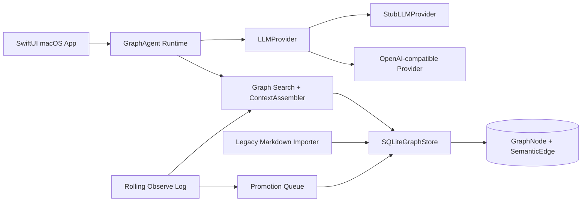

# connor-graph-agent-mac

A macOS-native graph knowledge agent client for Agent OS.

This project is a runnable Agent client, not a Markdown knowledge-base manager. Its runtime knowledge source of truth is a local graph store.

## Status

Current MVP status: **Phase 12 runnable acceptance build**.

Implemented layers:

- macOS SwiftUI app shell.
- Unified graph domain model.
- Rolling one-month Observe Log short-term memory.
- SQLite graph store.
- Legacy Markdown read-only importer.
- Graph search and context assembly.
- Graph-backed Agent runtime.
- Observe Log promotion queue.
- Stub LLM provider for deterministic local testing.
- OpenAI-compatible LLM provider interface for real model calls.

## Product principle

Markdown is **not** the final knowledge carrier.

Markdown may be used only as:

- legacy import source,
- human-readable export projection,
- evidence/source snapshot,
- interoperability format.

Runtime knowledge lives in:

```text
GraphNode + SemanticEdge + ObserveLogEntry + SQLiteGraphStore
```

Existing knowledge-base concepts are represented as graph-native typed nodes and semantic edges:

- Question Ledger → `GraphNode(type: .question)`
- Answer Cache → `GraphNode(type: .answer)`
- Work Object → `GraphNode(type: .workObject)`
- Decision → `GraphNode(type: .decision)`
- SOP / Runbook → `GraphNode(type: .procedure)`
- Person Profile → `GraphNode(type: .person)`
- User Preference → `GraphNode(type: .preference)`

## Architecture



## Module map

```text
Sources/
  ConnorGraphCore/      Unified graph model: GraphNode, SemanticEdge, typed relations
  ConnorGraphMemory/    Observe Log, rolling policy, promotion queue
  ConnorGraphStore/     SQLite graph and observe-log persistence
  ConnorGraphImport/    Legacy Markdown → graph import
  ConnorGraphSearch/    In-memory search index and AgentContext assembly
  ConnorGraphAgent/     Agent runtime, chat controller, LLM providers
  ConnorGraphAgentMac/  SwiftUI macOS app shell
```

## Run locally

From this directory:

```bash
swift run connor-graph-agent-mac
```

The current app launches with demo graph data so the UI works without any API key or external dependency.

Current SwiftUI pages:

- **Graph Nodes** — inspect demo nodes and edges.
- **Search** — run graph / edge / observe-log search.
- **Observe Log** — inspect short-term memory entries.
- **Agent Chat** — ask the graph-backed agent using `StubLLMProvider`.

## Test and build

```bash
swift test
swift build
```

Current acceptance baseline:

```text
50 tests passing
Build complete
```

## Real LLM provider

The runtime supports an OpenAI-compatible provider. Secrets are read only from environment variables and must not be committed.

Environment variables:

```bash
export CONNOR_LLM_API_KEY="..."
export CONNOR_LLM_BASE_URL="https://api.openai.com/v1" # optional
export CONNOR_LLM_MODEL="gpt-4o-mini"                 # optional
```

Provider type:

```swift
OpenAICompatibleProvider(
    config: try OpenAICompatibleConfig.fromEnvironment(ProcessInfo.processInfo.environment)
)
```

Notes:

- If `CONNOR_LLM_API_KEY` is missing, optional smoke tests skip automatically.
- `StubLLMProvider` remains the default for tests and local demo UI.
- The provider sends graph context through `AgentContext.renderedText`.
- `LLMResponse.citations` preserves graph source IDs from the context assembler.

## Read-only legacy knowledge import

The importer can scan an existing Markdown-based repository without modifying source files.

Programmatic entry point:

```swift
let store = try SQLiteGraphStore(path: "graph.sqlite")
try store.migrate()
let report = try LegacyKnowledgeDirectoryImporter(store: store)
    .importDirectory(URL(fileURLWithPath: "/path/to/intelligence-repository"))
```

Report fields:

```swift
LegacyDirectoryImportReport(
    scannedFiles: Int,
    importedNodes: Int,
    importedEdges: Int,
    skippedFiles: Int,
    warnings: [LegacyImportWarning]
)
```

Real repository smoke test is opt-in:

```bash
CONNOR_REAL_REPO_IMPORT_PATH=/Users/duanshiwen/notes/intelligence-repository \
  swift test --filter realIntelligenceRepositoryReadOnlyImportSmoke
```

## Observe Log and Promotion Queue

Short-term memory is represented by `ObserveLogEntry` and defaults to a 30-day rolling retention policy.

Supported observe-log kinds include:

- `operation`
- `toolEvent`
- `insight`
- `fragment`
- `observation`
- `candidateFact`
- `decisionHint`
- `userPreference`

Promotion queue behavior:

```text
candidateFact  → SemanticEdge draft
decisionHint   → Decision GraphNode draft + BELONGS_TO edge when workObjectID exists
userPreference → Preference GraphNode draft + HAS_PREFERENCE edge
```

Queue operations:

- `promote`
- `dismiss`
- `pin` for another 30 days

## Current limitations

This is intentionally an MVP, not the final Agent OS client.

Known limitations:

- SwiftUI app currently uses demo graph data by default.
- App UI does not yet persist chat sessions to SQLite.
- App UI does not yet expose real LLM configuration.
- Legacy importer uses frontmatter and path heuristics; it does not yet run LLM-based entity extraction.
- Search is currently in-memory lexical matching, not embedding / hybrid search.
- Promotion queue exists in the domain layer but is not yet wired into a full review UI.
- No Graphiti sidecar adapter yet.
- No Keychain-backed credential manager yet.

## Roadmap after MVP

Recommended next phases:

1. Wire SwiftUI app to Application Support SQLite instead of demo-only memory.
2. Add import command / UI for read-only intelligence-repository ingestion.
3. Add Promotion Queue review screen with promote / dismiss / pin actions.
4. Add Keychain-backed LLM credential storage.
5. Add real chat session persistence.
6. Add hybrid retrieval: lexical + embedding + graph neighborhood.
7. Add Graphiti adapter for temporal fact extraction, deduplication and invalidation.
8. Add human-readable export projections for graph slices.

## Development discipline

Every implementation phase should be validated with:

```bash
swift test
swift build
```

Each phase should be committed independently with a clear commit message and Craft Agent co-author trailer.
