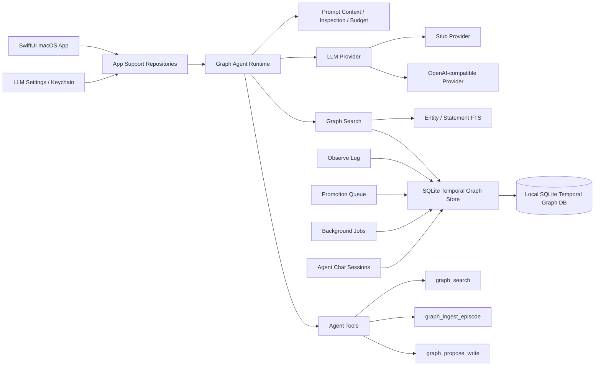
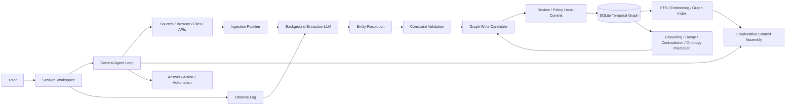
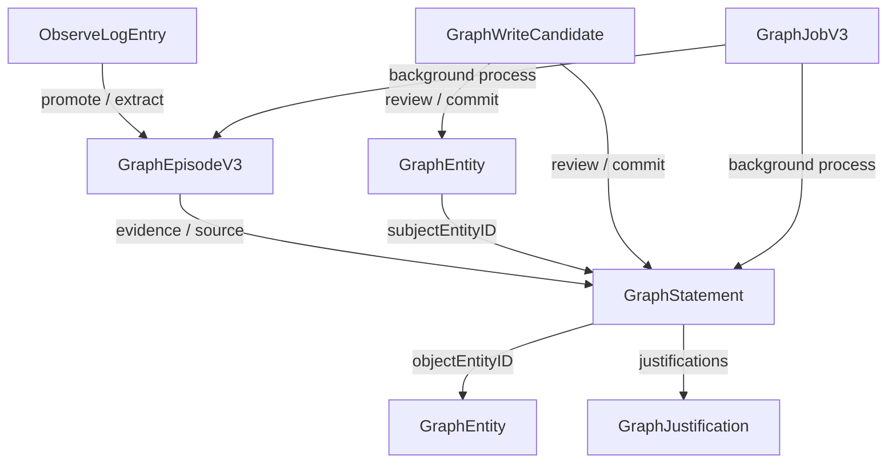

# Connor Graph Agent Mac

Connor Graph Agent Mac 是一个面向 macOS 的本地优先知识图谱 Agent 客户端。它的长期目标不是做一个“图谱构建工具”，而是做一个**通用助手**：用户正常对话、检索、执行任务；知识图谱作为后台记忆、证据、推理和长期智能基础设施持续工作。

换句话说：

```text
Connor = 通用 Agent 产品
Graph = 后台记忆基础设施
SQLite Temporal Graph = 本地 truth layer
```

本项目当前聚焦于 Agent OS 的知识与长期记忆层：以本地 SQLite temporal graph 为运行时知识源，支持图谱检索、对话上下文注入、Observe Log、候选写入、后台作业、图谱自愈框架和 SwiftUI Mac 原型界面。

---

## 核心产品定位

Connor Graph Agent Mac 的产品定位是：

> 一个具备长期记忆、证据追踪、实体关系理解、时序事实更新和本地优先隐私边界的图谱增强型通用 AI 助手。

它不应被理解为：

- Markdown 知识库管理器；
- 普通 RAG demo；
- 手动知识图谱编辑器；
- 仅用于抽取实体关系的后台工具。

它应该被理解为：

- 用户日常工作、研究、项目、关系、决策和偏好的本地智能层；
- Agent OS 的长期记忆内核；
- 可以接入外部 source、浏览器、文件、消息和业务系统的通用助手；
- 以 temporal knowledge graph 提升准确性、可追溯性、个性化和长期连续性的商业化产品。

---

## 当前架构收敛

当前分支已经完成两项重要收敛：

1. **只保留一套图模型**：temporal graph 模型，不再维护早期简单节点边图。
2. **只保留一条主检索路径**：App Search 与 Agent Context 均应走 `GraphHybridSearchService` / `SQLiteGraphHybridSearchService`。

早期简单图模型、历史 Markdown 导入链路、基于数组扫描的内存搜索索引都已移除，不再保留兼容层。

---

## 当前状态

当前代码基线处于：

```text
temporal graph-only
+ SQLite-backed graph store
+ graph-aware agent runtime
+ SwiftUI Mac app prototype
+ production-oriented graph memory architecture in progress
```

### 已完成并验证

- macOS SwiftUI 应用外壳。
- SwiftPM 包结构与 Xcode macOS App 工程。
- Temporal graph 领域模型：
  - `GraphEntity`
  - `GraphStatement`
  - `GraphEpisodeV3`
  - `ObserveLogEntry`
  - `GraphJustification`
  - `GraphJobV3`
- SQLite 本地图谱存储：`SQLiteGraphKernelStore` / `SQLiteGraphStore`。
- 本地 SQLite schema migration。
- 图谱实体、事实、episode、observe log、chat session、agent message、summary、prompt inspection 持久化。
- SQLite-backed graph search 基础路径：entity FTS + statement FTS。
- 图谱时序过滤与 belief status 过滤。
- SQLite 图遍历层，作为 Neo4j / FalkorDB 的本地替代基座。
- Agent runtime 与 graph search 上下文注入。
- Agent Chat 会话与消息持久化。
- Agent prompt inspection / prompt budget 估算。
- Agent session summary 策略与刷新状态。
- Observe Log 短期记忆与 Promotion Queue。
- 图谱候选写入模型：`GraphWriteCandidate`。
- Agent 图谱读写工具：
  - `graph_search`
  - `graph_ingest_episode`
  - `graph_propose_write`
- Agent Loop 基础能力：
  - 多轮 tool calling；
  - tool registry；
  - tool requested / started / finished / failed events；
  - budget meter；
  - permission policy；
  - audit log；
  - event recorder。
- Stub LLM provider，用于本地确定性测试。
- OpenAI-compatible provider，用于真实模型调用。
- OpenAI-compatible tool calling。
- LLM Settings UI 与 macOS Keychain API key 存储。
- Provider health check / Test Connection。
- 后台作业框架：
  - extraction；
  - index refresh；
  - anomaly resolution；
  - entity merge review。
- SwiftPM `swift build` 通过。

### 已有但仍需补齐的能力

以下能力已经有模型、接口或框架，但还不是可商用完成态：

- `GraphExtractorProvider` 已定义，但默认实现仍是 `StubGraphExtractor`。
- 后台 extraction job pipeline 已存在，但真实 LLM-backed extraction 尚未接入。
- `GraphBackgroundJobRunner` 已支持多类 job，但以下 worker 仍未实现：
  - `groundingCheck`
  - `confidenceDecay`
  - `ontologyPromotion`
- `SQLiteGraphHybridSearchService` 当前主要覆盖 entity / statement FTS；README 中所描述的完整 Graphiti-grade hybrid pipeline 是目标架构，仍需补齐：
  - episode FTS；
  - embedding semantic retrieval；
  - RRF fusion；
  - graph topology reranking；
  - episode mention boost；
  - MMR diversity reranking；
  - optional cross-encoder reranking。
- Entity resolver 与 entity merge review 已有基础，但尚未成为所有 extraction/write 的强制主路径。
- Ontology / class promotion 的数据模型方向已具备，但缺少完整生命周期和 UI。
- Permission model 已有 graph-specific capability，但缺少产品级审批 UI、pending approval queue 和 per-source/per-scope policy。

### 当前测试说明

当前 shell 环境执行 `swift test` 可能因缺少 Swift Testing 模块报：

```text
no such module 'Testing'
```

这是命令行 Swift toolchain 环境问题。需要在支持 Swift Testing 的 Xcode/Swift 工具链环境下运行全量测试。

---

## 与 Craft Agents OSS 的关系

本项目应参考但不复制 Craft Agents OSS。

Craft Agents OSS 是成熟的通用 Agent 工作台：

- Session / Workspace / Message / AgentEvent 抽象成熟；
- Claude Agent SDK 与 Pi SDK 多后端接入成熟；
- MCP / REST / local source 系统成熟；
- 权限模式、PreToolUse、配置校验、OAuth、Credential、自动化、消息网关、桌面 UI 都较完整；
- 适合作为 Agent OS 产品外壳、会话系统、source 系统和权限治理的架构参考。

但 Craft Agents OSS 基本没有真正的知识图谱长期记忆层：

- 没有 temporal knowledge graph；
- 没有 entity resolution 主路径；
- 没有 graph-backed memory；
- 没有 bitemporal fact / justification / belief revision；
- 没有 ontology promotion / graph self-healing；
- 没有 graph-native context assembly。

Connor Graph Agent Mac 的角色正好互补：

```text
Craft Agents OSS = Agent product shell / session OS / source system / permission runtime
Connor Graph Agent Mac = graph memory kernel / temporal knowledge layer / local-first intelligence layer
```

长期产品路线应是：

```text
借鉴 Craft 的 Agent OS 外壳能力
保留 Connor 的 graph memory kernel 作为差异化智能底座
```

---

## 总体架构



### 目标商用架构



---

## 数据模型关系



---

## 产品原则

### 1. 图谱是后台记忆基础设施，不是前台任务

用户不应该被迫说：

```text
帮我抽取实体和关系
```

用户应该正常说：

```text
帮我分析这个项目下一步怎么做
记住这个偏好
帮我找之前关于这个人的讨论
这个决策为什么这么定
```

系统在后台自动完成：

```text
observe
→ extract
→ resolve
→ validate
→ write candidate
→ review / commit
→ index
→ retrieve
→ self-heal
```

### 2. 对话 LLM 与提取 LLM 分离

对话 LLM 负责：

- 回答问题；
- 使用工具；
- 执行任务；
- 解释证据；
- 与用户协作。

提取 LLM 负责：

- 从对话、网页、文件、source artifact 中提取 entities / statements / mentions；
- 生成结构化 draft；
- 提供 evidence span、confidence 和 uncertainty；
- 不直接污染 graph truth layer。

### 3. 本地 SQLite 是 truth layer

默认行为保持 local-first：

- 本地 SQLite 是知识图谱 truth layer；
- 不默认依赖 Neo4j / FalkorDB；
- 不默认依赖外部 reranker 服务；
- 不要求真实 LLM API key 才能启动和测试；
- 外部模型能力通过 adapter 扩展，不能成为基础可用性的前提。

### 4. Agent 不直接乱写图谱

LLM 写图谱必须经过：

```text
Evidence Episode
→ Extraction Draft
→ Entity Resolution
→ Constraint Validation
→ Graph Write Candidate
→ Policy / Review / Auto-Commit
→ Index Refresh
```

除非明确进入 trusted write path，否则 Agent 不应直接 commit 事实。

### 5. 商用产品优先于 demo 功能

后续开发不以 MVP 为目标，而以可商用产品为目标。

这意味着所有关键能力都必须考虑：

- 数据迁移；
- 权限与审计；
- 错误恢复；
- 用户可解释性；
- 成本与 token 预算；
- 本地隐私；
- 可测试性；
- 可观测性；
- 可导出与可迁移；
- 长期运行稳定性。

---

## 目录结构

```text
.
├── Package.swift
├── README.md
├── ConnorGraphAgentMac.xcodeproj
├── Sources
│   ├── ConnorGraphCore
│   ├── ConnorGraphMemory
│   ├── ConnorGraphStore
│   ├── ConnorGraphSearch
│   ├── ConnorGraphAgent
│   ├── ConnorGraphAppSupport
│   └── ConnorGraphAgentMac
└── Tests
    ├── ConnorGraphCoreTests
    ├── ConnorGraphMemoryTests
    ├── ConnorGraphStoreTests
    ├── ConnorGraphSearchTests
    ├── ConnorGraphAgentTests
    └── ConnorGraphAppSupportTests
```

---

## 模块说明

### `ConnorGraphCore`

核心领域模型层。

主要职责：

- Agent conversation model；
- temporal graph model；
- graph entity / statement / episode；
- graph predicate / edge kind / scope / status；
- justification / belief status；
- background job domain；
- write candidate domain。

代表文件：

```text
Sources/ConnorGraphCore/AgentConversation.swift
Sources/ConnorGraphCore/GraphKernelDomain.swift
Sources/ConnorGraphCore/GraphExtractionDomain.swift
Sources/ConnorGraphCore/GraphOptimisticWriteDomain.swift
Sources/ConnorGraphCore/GraphSelfHealingDomain.swift
Sources/ConnorGraphCore/GraphWriteCandidate.swift
```

### `ConnorGraphMemory`

短期记忆、候选提升、约束和矛盾检测层。

主要职责：

- Observe Log；
- Promotion Queue；
- graph constraint validation；
- contradiction detection；
- memory promotion policy。

代表文件：

```text
Sources/ConnorGraphMemory/ObserveLog.swift
Sources/ConnorGraphMemory/MemoryPromotion.swift
Sources/ConnorGraphMemory/GraphConstraintValidator.swift
Sources/ConnorGraphMemory/GraphContradictionDetector.swift
```

### `ConnorGraphStore`

SQLite 持久化、FTS、后台作业、图谱写入和自愈服务层。

主要职责：

- SQLite schema migration；
- GraphEntity / GraphStatement / GraphEpisodeV3 持久化；
- ObserveLogEntry 持久化；
- Chat sessions/messages 持久化；
- Graph embeddings 持久化；
- FTS 查询；
- SQLite graph traversal；
- entity resolution；
- optimistic write；
- background job runner；
- extraction worker；
- index refresh worker；
- self-healing service；
- entity merge review worker。

代表文件：

```text
Sources/ConnorGraphStore/SQLiteGraphKernelStore.swift
Sources/ConnorGraphStore/SQLiteGraphStore.swift
Sources/ConnorGraphStore/SQLiteGraphHybridSearchService.swift
Sources/ConnorGraphStore/SQLiteGraphEntityResolver.swift
Sources/ConnorGraphStore/GraphOptimisticWriteService.swift
Sources/ConnorGraphStore/GraphBackgroundJobRunner.swift
Sources/ConnorGraphStore/GraphExtractionWorker.swift
Sources/ConnorGraphStore/GraphIndexRefreshWorker.swift
Sources/ConnorGraphStore/GraphSelfHealingService.swift
Sources/ConnorGraphStore/GraphEntityMergeReviewWorker.swift
```

### `ConnorGraphSearch`

搜索抽象层。

主要职责：

- `GraphSearchQuery`；
- `GraphSearchHit`；
- `GraphSearchResponse`；
- `GraphHybridSearchService` 协议；
- graph context assembly 所需的 search result shape。

代表文件：

```text
Sources/ConnorGraphSearch/GraphHybridSearch.swift
Sources/ConnorGraphSearch/GraphSearch.swift
Sources/ConnorGraphSearch/EmbeddingProvider.swift
```

### `ConnorGraphAgent`

Agent runtime 层。

主要职责：

- LLM provider 抽象；
- Stub provider；
- OpenAI-compatible provider；
- Agent chat orchestration；
- Agent Loop；
- tool registry；
- graph read/write tools；
- web/search tools；
- permission policy；
- audit log；
- event stream；
- prompt inspection；
- prompt budget estimate；
- session summary refresh strategy。

代表文件：

```text
Sources/ConnorGraphAgent/GraphAgentRuntime.swift
Sources/ConnorGraphAgent/AgentLoopController.swift
Sources/ConnorGraphAgent/AgentTool.swift
Sources/ConnorGraphAgent/GraphReadTools.swift
Sources/ConnorGraphAgent/GraphWriteTools.swift
Sources/ConnorGraphAgent/OpenAICompatibleProvider.swift
Sources/ConnorGraphAgent/AgentPermission.swift
```

### `ConnorGraphAppSupport`

App 侧 repository 和系统集成层。

主要职责：

- app storage path resolution；
- SQLite store bootstrap；
- graph repository；
- chat session repository；
- write candidate repository；
- promotion queue repository；
- agent runtime factory；
- background job runner factory；
- LLM settings 持久化；
- Keychain credential storage；
- provider health check。

代表文件：

```text
Sources/ConnorGraphAppSupport/AppGraphBootstrapper.swift
Sources/ConnorGraphAppSupport/AppGraphRepository.swift
Sources/ConnorGraphAppSupport/AppChatSessionRepository.swift
Sources/ConnorGraphAppSupport/AppGraphAgentRuntimeFactory.swift
Sources/ConnorGraphAppSupport/AppGraphBackgroundJobRunner.swift
Sources/ConnorGraphAppSupport/AppLLMSettingsRepository.swift
Sources/ConnorGraphAppSupport/KeychainCredentialStore.swift
```

### `ConnorGraphAgentMac`

SwiftUI macOS App 层。

主要职责：

- macOS App entry point；
- sidebar navigation；
- graph overview；
- search UI；
- observe log UI；
- promotion queue UI；
- agent chat UI；
- prompt inspection UI；
- model settings UI；
- browser workspace view。

代表文件：

```text
Sources/ConnorGraphAgentMac/ConnorGraphAgentMacApp.swift
Sources/ConnorGraphAgentMac/AgentChatView.swift
Sources/ConnorGraphAgentMac/BrowserWorkspaceView.swift
Sources/ConnorGraphAgentMac/EmptyGraphHybridSearchService.swift
```

---

## 构建与运行

### SwiftPM build

```bash
cd /Users/duanshiwen/code/agent-os/agents/connor-graph-agent-mac
swift build
```

当前结果：

```text
ok (build complete)
```

### SwiftPM test

```bash
swift test
```

当前 shell 环境可能报：

```text
no such module 'Testing'
```

这是当前命令行 Swift toolchain 缺少 Swift Testing 模块导致的环境问题。需要在支持 Swift Testing 的 Xcode/Swift 工具链环境下运行。

### Xcode App

可以通过 Xcode 打开：

```text
ConnorGraphAgentMac.xcodeproj
```

App target 依赖本地 SwiftPM package products：

```text
ConnorGraphCore
ConnorGraphMemory
ConnorGraphStore
ConnorGraphSearch
ConnorGraphAgent
ConnorGraphAppSupport
```

---

## 开发约束

### 不要恢复 legacy import

不要重新引入：

```text
ConnorGraphImport
LegacyMarkdownImport
LegacyKnowledgeDirectoryImporter
AppImportReport
ImportKnowledgeView
```

如果未来需要从外部资料进入图谱，应设计新的 ingestion pipeline，直接写入 temporal graph：

```text
source artifact
→ GraphEpisodeV3
→ GraphExtractionDraft
→ GraphEntity / GraphStatement candidates
→ Entity Resolution
→ Graph Write Candidate
→ GraphEmbedding / FTS indexing
→ graph-native retrieval
```

Markdown 只应作为：

- 人类可读导出投影；
- evidence/source snapshot；
- 跨系统互操作格式。

### 不要恢复早期简单图模型

不要重新引入：

```text
GraphNode
SemanticEdge
NodeStatus
graph_nodes
semantic_edges
```

所有节点和关系都应落到：

```text
GraphEntity
GraphStatement
GraphEpisodeV3
```

### 不要恢复内存搜索索引

不要重新引入：

```text
InMemoryGraphSearchIndex
GraphSearchOptions
ContextAssembler
snapshot-based array scan search
```

所有 App Search 和 Agent Context 都应走：

```text
GraphHybridSearchService
SQLiteGraphHybridSearchService
```

### 不要让 LLM 直接污染图谱

不要让对话 LLM 直接创建最终 truth-level fact。

正确路径是：

```text
LLM proposes
System resolves
Validator checks
Policy decides
User or trusted rule approves
Store commits
Index refreshes
```

---

# 商用产品开发计划

本项目后续不以 MVP 为目标，而以**可商用产品**为目标。这里的“可商用”不是指功能很多，而是指：长期可运行、数据可信、可恢复、可审计、可解释、可迁移，并能支撑真实用户把个人或团队工作记忆托付给系统。

## 商用目标版本定义

商业化版本应满足：

1. 用户可以长期使用，而不是演示一次；
2. Agent 能持续积累可靠记忆，而不是每次从零开始；
3. 图谱错误可发现、可解释、可修复；
4. 所有关键写入有证据、有来源、有审计；
5. 本地数据可备份、迁移、导出；
6. 模型、source、权限、成本都可配置；
7. 产品 UI 能让普通高级用户理解系统在记住什么、为什么记住、何时使用；
8. 能从个人 local-first 产品自然升级到团队/企业部署。

---

## Roadmap A：Graph Memory Commercial Core

目标：把当前图谱原型升级为真正可商用的图谱记忆内核。

### A1. LLM-backed Graph Extraction

交付物：

- 新增 `LLMGraphExtractor`，替代默认 `StubGraphExtractor`。
- 支持 `GraphExtractionSource → GraphExtractionDraft`。
- 提取结果包含：
  - candidate entities；
  - candidate statements；
  - mentions；
  - evidence spans；
  - confidence；
  - uncertainty；
  - suggested classifications；
  - possible new class proposals。
- 使用结构化 JSON schema，所有输出可验证。
- 提取 prompt 动态注入：
  - allowed entity kinds；
  - allowed predicates；
  - existing candidate entities；
  - domain context；
  - strict evidence rules。

商用验收标准：

- 对同一输入重复提取结果稳定；
- 无 evidence span 的 fact 不可进入 trusted commit；
- malformed JSON 有自动修复或失败记录；
- extraction cost、latency、token usage 可记录；
- 所有 extraction job 可重放。

### A2. Entity Resolution 主路径

交付物：

- 所有 extraction/write 统一经过 entity resolver。
- Resolver 支持：
  - stable key；
  - exact name；
  - aliases；
  - fuzzy match；
  - graph neighborhood；
  - source-specific identity；
  - optional external grounding。
- 输出：
  - reuse existing；
  - create new；
  - merge candidate；
  - needs review。
- Entity merge review UI。

商用验收标准：

- 重复实体率可测；
- merge 操作可撤销或有 supersession 记录；
- 所有自动 merge 都有 reason trace；
- 高风险 merge 必须进入 review。

### A3. Graph Write Candidate Review

交付物：

- Rich diff UI：展示候选写入前后的图谱变化。
- Review actions：
  - accept；
  - reject；
  - edit；
  - merge；
  - defer；
  - mark as duplicate；
  - mark as unsafe。
- 每个 candidate 展示：
  - evidence episode；
  - evidence span；
  - extraction rationale；
  - resolver result；
  - constraint validation result；
  - contradiction warning；
  - confidence。

商用验收标准：

- 用户能理解“系统准备记住什么”；
- 用户能修改候选事实再提交；
- 所有 review 决策进入 audit log；
- 可按 session、source、work object 回溯。

### A4. Complete Hybrid Retrieval

交付物：

- Episode FTS。
- Entity FTS。
- Statement FTS。
- Embedding provider。
- Semantic retrieval。
- RRF fusion。
- Graph neighborhood expansion。
- Temporal filtering。
- Belief filtering。
- Evidence-aware context assembly。
- MMR diversity reranking。
- Search trace metadata。

商用验收标准：

- 每个 answer 能回溯到 graph hits 和 source episodes；
- retrieval trace 可视化；
- 同一 query 可解释为什么召回这些上下文；
- 支持按 scope / work object / time / source 过滤；
- 无 embedding provider 时 FTS fallback 仍可用。

### A5. Graph Self-Healing

交付物：

- `groundingCheck` worker。
- `confidenceDecay` worker。
- `ontologyPromotion` worker。
- contradiction detection。
- anomaly resolution queue。
- statement invalidation / supersession flow。

商用验收标准：

- 事实过期可被标记；
- 冲突事实不会静默覆盖；
- 系统能解释“为什么这条记忆不再可信”；
- 用户能查看记忆演化历史。

---

## Roadmap B：Agent Runtime Commercial Shell

目标：补齐商用 Agent 产品外壳，使 Connor 不只是 graph engine，而是可用的通用助手。

### B1. Session Manager

交付物：

- Session inbox。
- Session status。
- Session labels。
- Message persistence。
- Run persistence。
- AgentEvent stream。
- Tool call timeline。
- Abort / retry / resume。
- Session summary。
- Branching / fork。

参考方向：Craft Agents OSS 的 SessionManager / AgentBackend / AgentEvent 架构。

商用验收标准：

- 长任务中断可恢复；
- 每次 agent run 可追溯；
- UI 可展示工具调用和图谱写入过程；
- session 状态不依赖模型 SDK 内部状态。

### B2. AgentBackend 抽象

交付物：

统一接口：

```text
AgentBackend.chat(request) -> AsyncStream<AgentEvent>
AgentBackend.queryLLM(request)
AgentBackend.runMiniCompletion(prompt)
AgentBackend.abort()
```

支持 backend：

- OpenAI-compatible；
- Claude SDK；
- Pi SDK / subprocess；
- local model；
- dedicated extraction model。

商用验收标准：

- 模型供应商可替换；
- 主对话模型与提取模型可分离配置；
- mini completion / summarization / extraction 不污染主 session；
- backend failure 有清晰错误分类。

### B3. Permission & Policy Runtime

交付物：

- 产品级 permission prompt UI。
- Pending approval queue。
- Graph-specific policies。
- Source-specific policies。
- Scope-specific policies。
- Costly model call policy。
- External network policy。
- Destructive operation confirmation。
- Audit log viewer。

商用验收标准：

- 所有 graph write / merge / invalidate / delete 可审计；
- read-only mode 不会产生写入；
- ask mode 所有高风险操作必须等待用户确认；
- allow-all 仍保留审计。

### B4. Tool Runtime

交付物：

- Tool schema validation。
- Tool result size management。
- Tool timeout。
- Tool retry policy。
- Tool error classification。
- Tool permission pre-check。
- Tool observability。
- Built-in graph tools：
  - search；
  - ingest episode；
  - propose write；
  - inspect entity；
  - inspect statement；
  - inspect evidence；
  - explain answer context。

商用验收标准：

- 工具失败不会破坏 session；
- 工具调用可回放；
- 用户能理解工具结果；
- 大结果不会撑爆 prompt。

---

## Roadmap C：Source & Ingestion System

目标：让 Connor 从“本地聊天 + 图谱”升级为能接入真实世界信息流的通用助手。

### C1. Source Abstraction

交付物：

```text
SourceConfig
SourceAuth
SourceCredential
SourceTool
SourceArtifact
SourceIngestionPolicy
SourceSyncState
```

支持 source 类型：

- local files；
- browser pages；
- markdown/export files；
- REST API；
- MCP server；
- email；
- calendar；
- chat messages；
- Git repositories。

商用验收标准：

- source 可启用/禁用；
- source credential 安全存储；
- source artifact 可进入 GraphEpisode；
- source sync 可重试、可暂停、可审计。

### C2. Ingestion Pipeline

交付物：

```text
SourceArtifact
→ Normalization
→ GraphEpisodeV3
→ Extraction Job
→ Entity Resolution
→ Candidate Write
→ Review / Auto-Commit
→ Index Refresh
```

商用验收标准：

- 所有外部信息进入 graph 前都有 source lineage；
- ingestion 失败可重跑；
- ingestion 不阻塞主对话；
- 用户可按 source 查看已吸收内容。

### C3. Browser & Web Context

交付物：

- Browser workspace 与 Agent Chat 联动。
- 当前页面摘要。
- 选中文本 ingest。
- 页面 evidence snapshot。
- Web fetch artifact。
- Web source citation。

商用验收标准：

- 用户能把网页作为证据加入图谱；
- Agent 回答可引用网页 episode；
- 网页内容和图谱事实分离存储。

---

## Roadmap D：Commercial UI / UX

目标：让用户真正理解、控制、信任这个图谱 Agent。

### D1. Graph Memory Dashboard

交付物：

- Memory overview。
- Recent observations。
- Newly extracted candidates。
- Pending reviews。
- Conflicts / anomalies。
- Decayed facts。
- High-value entities。
- Work object memory map。

商用验收标准：

- 用户能回答：系统最近记住了什么？
- 用户能回答：哪些记忆需要我确认？
- 用户能回答：哪些记忆可能错了？

### D2. Entity / Statement Detail View

交付物：

- Entity profile。
- Aliases。
- Facts。
- Evidence episodes。
- Timeline。
- Related work objects。
- Confidence history。
- Merge history。
- Manual correction actions。

商用验收标准：

- 用户可检查任一实体的来源和关系；
- 用户可修正错误实体；
- 修正行为进入审计和自愈流程。

### D3. Answer Explainability

交付物：

每次回答展示：

- Used graph hits；
- Used episodes；
- Used statements；
- Retrieval method；
- Missing context；
- Confidence / caveats；
- Suggested memory updates。

商用验收标准：

- 用户能判断回答是否有依据；
- Agent 不把推测伪装成事实；
- 回答和记忆写入明确分离。

### D4. Settings & Operations

交付物：

- Model settings。
- Extraction model settings。
- Embedding settings。
- Source settings。
- Permission settings。
- Storage location。
- Backup / restore。
- Export。
- Diagnostics。
- Cost usage。

商用验收标准：

- 非开发者也能配置模型；
- 关键错误有可操作提示；
- 数据可备份和迁移。

---

## Roadmap E：Reliability, Security, and Commercial Readiness

目标：让系统能被真实用户长期依赖。

### E1. Storage Integrity

交付物：

- Schema version health check。
- Migration audit。
- Backup before migration。
- Integrity check。
- Corruption detection。
- Repair tools。

商用验收标准：

- 旧库升级不丢数据；
- schema mismatch 有明确提示；
- 用户可导出完整 graph archive。

### E2. Observability

交付物：

- Agent run trace。
- Tool trace。
- Model call trace。
- Extraction trace。
- Retrieval trace。
- Write candidate trace。
- Job trace。
- Cost trace。

商用验收标准：

- 任一错误可定位到 run / job / source / model call；
- 关键 pipeline 有 latency 和 failure metrics；
- 用户可导出诊断包。

### E3. Privacy & Security

交付物：

- Local-first storage policy。
- Secret storage via Keychain。
- Source credential isolation。
- Sensitive metadata redaction。
- Network call audit。
- Data export / delete。
- Scope-level privacy controls。

商用验收标准：

- 用户知道哪些数据出本机；
- 默认不上传本地图谱；
- API key 不进入日志；
- 删除/导出路径明确。

### E4. Testing Gates

交付物：

- Unit tests。
- Integration tests。
- Migration tests。
- Deterministic stub model tests。
- Extraction golden tests。
- Entity resolution tests。
- Retrieval quality tests。
- UI smoke tests。

商用验收标准：

- release 前测试可一键运行；
- graph write 不可无测试变更；
- extraction prompt 有 golden set 回归。

---

## Roadmap F：Team / Enterprise Path

个人版做好后，团队/企业版不是简单多用户，而是图谱边界和权限升级。

### F1. Workspace Graphs

交付物：

- Personal graph。
- Project graph。
- Organization graph。
- Shared work object graph。
- Cross-graph references。
- Scope-aware retrieval。

### F2. Collaboration

交付物：

- Shared review queue。
- Decision records。
- Team source ingestion。
- Role-based policy。
- Audit export。

### F3. Deployment

交付物：

- Local desktop。
- Headless local service。
- Private team server。
- Enterprise storage backend adapter。

---

## Recommended Implementation Order

不要先做“炫酷 UI”或“更多 source”。先打穿商业产品最核心的可信记忆闭环。

### 1. Production Extraction Loop

```text
LLMGraphExtractor
→ structured extraction schema
→ evidence span
→ extraction job trace
→ extraction golden tests
```

### 2. Resolver + Candidate Write Loop

```text
entity resolution
→ constraint validation
→ graph write candidate
→ review UI
→ audited commit
```

### 3. Retrieval Completion

```text
episode FTS
→ semantic retrieval
→ RRF
→ graph context assembly
→ answer explainability
```

### 4. Self-Healing Workers

```text
grounding check
→ confidence decay
→ contradiction/anomaly queue
→ ontology promotion
```

### 5. Session / Agent Shell Upgrade

```text
session manager
→ event stream
→ abort/resume
→ source runtime
→ permission prompts
```

### 6. Source System

```text
local files
→ browser pages
→ MCP / REST
→ email/calendar/chat
→ source-to-episode ingestion
```

### 7. Commercial UI and Ops

```text
memory dashboard
→ entity detail
→ statement detail
→ review queue
→ settings
→ diagnostics
→ backup/export
```

---

## Near-Term Engineering Checklist

优先级最高的具体工程任务：

1. 新增 `LLMGraphExtractor`，并保留 `StubGraphExtractor` 作为测试 double。
2. 新增 extraction JSON schema 与 prompt builder。
3. 将 `AppGraphBackgroundJobRunner` 支持根据 LLM settings 选择真实 extractor。
4. 为 `GraphExtractionWorker` 增加 extraction trace / raw response / validation failure 记录。
5. 将 `SQLiteGraphEntityResolver` 接入 optimistic write 主路径。
6. 补 `graph_episodes_v3` FTS 表和 episode search API。
7. 扩展 `SQLiteGraphHybridSearchService`，支持 entity + statement + episode 三类结果。
8. 为 graph write candidate 做 richer diff UI。
9. 实现 `groundingCheck` worker 的最小可用版本。
10. 实现 schema/version health check，启动时展示图模型版本。

---

## License

This project is licensed under the MIT License. See [LICENSE](./LICENSE) for details.
