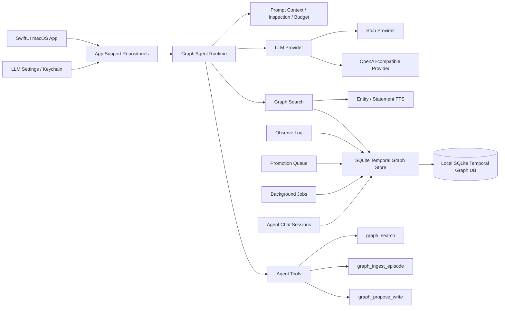
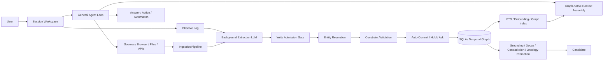
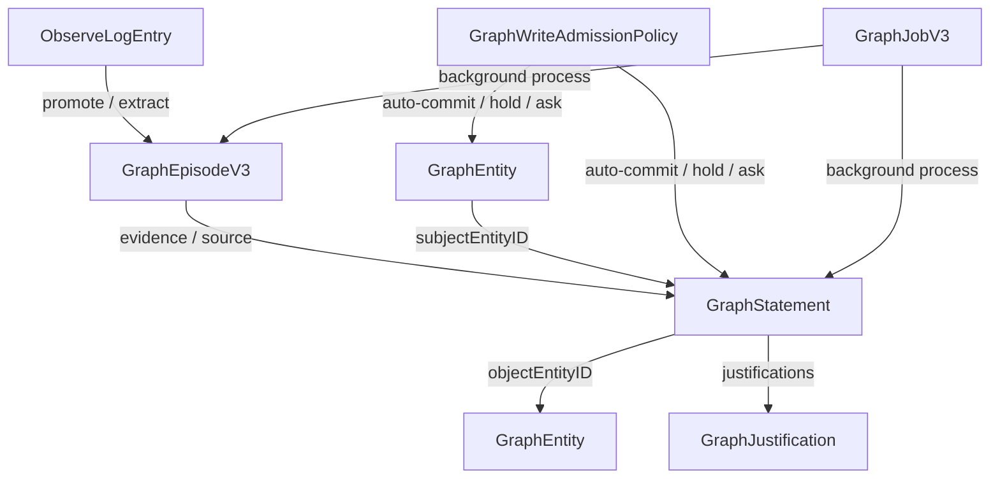

# Connor Graph Agent Mac

Connor Graph Agent Mac 是一个面向 macOS 的本地优先知识图谱 Agent 客户端。它的长期目标不是做一个“图谱构建工具”，而是做一个**通用助手**：用户正常对话、检索、执行任务；知识图谱作为后台记忆、证据、推理和长期智能基础设施持续工作。

换句话说：

```text
Connor = 通用 Agent 产品
Graph = 后台记忆基础设施
SQLite Temporal Graph = 本地 truth layer
```

本项目当前聚焦于 Agent OS 的知识与长期记忆层：以本地 SQLite temporal graph 为运行时知识源，支持图谱检索、对话上下文注入、Observe Log、候选写入、后台作业、图谱自愈框架和 SwiftUI Mac 原型界面。

---

## 核心产品定位

Connor Graph Agent Mac 的产品定位是：

> 一个具备长期记忆、证据追踪、实体关系理解、时序事实更新和本地优先隐私边界的图谱增强型通用 AI 助手。

它不应被理解为：

- Markdown 知识库管理器；
- 普通 RAG demo；
- 手动知识图谱编辑器；
- 仅用于抽取实体关系的后台工具。

它应该被理解为：

- 用户日常工作、研究、项目、关系、决策和偏好的本地智能层；
- Agent OS 的长期记忆内核；
- 可以接入外部 source、浏览器、文件、消息和业务系统的通用助手；
- 以 temporal knowledge graph 提升准确性、可追溯性、个性化和长期连续性的商业化产品。

---

## 当前架构收敛

当前分支已经完成两项重要收敛：

1. **只保留一套图模型**：temporal graph 模型，不再维护早期简单节点边图。
2. **只保留一条主检索路径**：App Search 与 Agent Context 均应走 `GraphHybridSearchService` / `SQLiteGraphHybridSearchService`。

Phase 0 已冻结下一阶段产品架构方向，详见 [`docs/architecture/native-connor-agent-os.md`](docs/architecture/native-connor-agent-os.md)：Connor 是 macOS 原生 Graph-Native Agent OS；Craft Agents OSS 是成熟系统蓝本而不是 Electron 代码基底；产品不引入多 workspace；Session、权限、图谱记忆和审计状态由 Connor 自己持有；Claude Agent SDK 未来作为 sidecar backend 接入，而不是产品状态主权方。

Phase 2 已开始冻结 `AgentBackend` 与 Claude SDK sidecar 边界，详见 [`docs/architecture/phase-2-agent-backend-sidecar.md`](docs/architecture/phase-2-agent-backend-sidecar.md)：`NativeSessionManager` 只依赖统一 backend 事件流；Claude SDK 作为外部 sidecar engine；SDK session / permission 只作为 metadata，不成为 Connor 产品状态主权方。

早期简单图模型、历史 Markdown 导入链路、基于数组扫描的内存搜索索引都已移除，不再保留兼容层。

---

## 当前状态

当前代码基线处于：

```text
temporal graph-only
+ SQLite-backed graph store
+ graph-aware agent runtime
+ tool-calling agent loop foundation
+ background extraction/admission pipeline
+ SwiftUI Mac app prototype
+ production-oriented graph memory architecture in progress
```

截至本轮源码扫描，项目已经不是普通 demo，而是一个 **Swift/macOS 本地优先的 temporal knowledge graph memory kernel + graph-aware agent prototype**。它的核心优势在于：本地 truth layer、时序事实、证据 episode、实体消歧、写入准入、抽取 trace、自愈框架和可审计记忆变更。下一阶段的重点不是继续堆更多图谱模型，而是打通“正常对话 → 自动观察 → 后台抽取 → 准入写入 → 下次回答可检索引用”的产品闭环。

### 已完成并验证

- macOS SwiftUI 应用外壳。
- SwiftPM 包结构与 Xcode macOS App 工程。
- Temporal graph 领域模型：
  - `GraphEntity`
  - `GraphStatement`
  - `GraphEpisodeV3`
  - `ObserveLogEntry`
  - `GraphJustification`
  - `GraphJobV3`
- SQLite 本地图谱存储：`SQLiteGraphKernelStore` / `SQLiteGraphStore`。
- 本地 SQLite schema migration。
- 图谱实体、事实、episode、observe log、chat session、agent message、summary、prompt inspection 持久化。
- SQLite-backed graph search 基础路径：entity FTS + statement FTS + episode FTS。
- 图谱时序过滤与 belief status 过滤。
- SQLite 图遍历层，作为 Neo4j / FalkorDB 的本地替代基座。
- Agent runtime 与 graph search 上下文注入。
- Agent Chat 会话与消息持久化。
- Agent prompt inspection / prompt budget 估算。
- Agent session summary 策略与刷新状态。
- Observe Log 短期记忆与 Promotion Queue。
- Memory Staging / Ingestion 领域模型：
  - `ConversationTurnBundle`；
  - `MemoryStagingBuffer`；
  - distillation trigger policy；
  - `MemoryDistillationResult` / candidate / source ref / trace；
  - `MemoryIngestionService`，支持 message / artifact 增量摄入、message id 去重、open bundle 合并与触发原因计算；
  - SQLite-backed `memory_staging_buffers` repository 与 AppSupport 包装器；
  - App `AgentLoopChatController` 写入路径接入：user message 进入 open bundle，assistant `textComplete` 关闭 bundle 并持久化；
  - deterministic `MemoryDistillationService` + LLM-backed `LLMMemoryDistiller` + App worker，将 closed staging bundles 分类为 episode / preference / decision / project fact 等 candidates，经 quality gate 后转为 chat `GraphExtractionSource` 并入队 existing extraction jobs；LLM distiller 失败时自动 fallback 到 deterministic distiller。
- 图谱候选写入模型：`GraphWriteCandidate`。
- Agent 图谱读写工具：
  - `graph_search`
  - `graph_ingest_episode`
  - `graph_propose_write`
- Agent Loop 基础能力：
  - 多轮 tool calling；
  - tool registry；
  - tool requested / started / finished / failed events；
  - budget meter；
  - permission policy；
  - audit log；
  - event recorder。
- Stub LLM provider，用于本地确定性测试。
- OpenAI-compatible provider，用于真实模型调用。
- OpenAI-compatible tool calling。
- LLM Settings UI 与 macOS Keychain API key 存储。
- Provider health check / Test Connection。
- 后台作业框架：
  - extraction；
  - index refresh；
  - anomaly resolution；
  - entity merge review。
- Extraction/admission 主路径：
  - `GraphExtractorProvider` 抽象；
  - `LLMGraphExtractor` / `StubGraphExtractor`；
  - `GraphExtractionPromptBuilder`；
  - `GraphExtractionDecoder`；
  - `GraphWriteAdmissionPolicy`；
  - `GraphExtractionTrace`；
  - `GraphAdmissionHoldQueue`；
  - `GraphMemoryChangeLog`。
- Hybrid retrieval 初版：
  - statement/entity/episode FTS；
  - graph neighborhood expansion；
  - source episode expansion；
  - weighted rank-style fusion；
  - hit metadata 中记录 fusion 与 graph context；
  - App 主 `AgentLoopController` 首轮模型调用前会通过 `AgentContextBuilder` + `SQLiteGraphHybridSearchService` 注入相关长期图谱记忆，并将命中 source IDs 作为 response citations 返回。
- SwiftPM `swift build` 通过。

### 已有但仍需补齐的能力

以下能力已经有模型、接口或框架，但还不是可商用完成态：

- `GraphExtractorProvider` 已定义，`StubGraphExtractor` 保留为测试 double / fallback。
- 已新增 production-oriented extraction 基础设施：
  - `GraphStructuredExtractionOutput`；
  - `GraphExtractionDecoder`；
  - `GraphExtractionPromptBuilder`；
  - `LLMGraphExtractor`；
  - `AnyGraphExtractorProvider`；
  - `AppGraphBackgroundJobRunner` 的 LLM settings 接线。
- 后台 extraction job pipeline 已可选择 LLM-backed extractor，并已接入 `GraphWriteAdmissionPolicy`：默认系统自动准入，高风险/低置信/缺证据时 hold 或 ask，而不是要求用户逐条审核。
- 已新增 `GraphExtractionTrace` / `graph_extraction_traces`，持久化 extraction/admission 结果摘要，并在 macOS App 中提供“记忆准入”诊断视图。
- `GraphBackgroundJobRunner` 已支持多类 job，但以下 worker 仍未实现：
  - `groundingCheck`
  - `confidenceDecay`
  - `ontologyPromotion`
- `SQLiteGraphHybridSearchService` 已覆盖 entity / statement / episode FTS，并实现 graph neighborhood expansion、source episode expansion 和初版融合；完整 Graphiti-grade hybrid pipeline 仍需补齐：
  - embedding semantic retrieval；
  - 正式 RRF fusion 与 query planner；
  - graph topology reranking；
  - entity linking / entity-centric retrieval；
  - episode mention boost；
  - MMR diversity reranking；
  - optional cross-encoder reranking；
  - retrieval trace 可视化。
- Entity resolver、entity resolution plan 与 entity merge review 已有基础，并已进入 extraction admission 主路径；下一步需要让所有 extraction/write/手动候选提交都强制经过统一 resolver。
- Ontology / class promotion 的数据模型方向已具备，但缺少完整生命周期和 UI。
- Permission model 已有 graph-specific capability，但缺少产品级审批 UI、pending approval queue、always-allow、per-source/per-scope policy，以及与 session mode 的完整联动。

### 当前测试说明

全量测试已迁移到当前 V3 graph kernel / repository 边界，并在 Xcode toolchain 下验证通过：

```bash
DEVELOPER_DIR=/Applications/Xcode.app/Contents/Developer swift test
```

当前验证结果：

```text
Test run with 234 tests in 1 suite passed
```

如果本机默认 developer directory 仍指向 Command Line Tools，直接执行 `swift test` 可能因缺少 Swift Testing 模块报：

```text
no such module 'Testing'
```

这是本地 Swift toolchain 选择问题，不是项目测试失败。可通过设置 `DEVELOPER_DIR` 临时使用 Xcode toolchain，或用 `sudo xcode-select -s /Applications/Xcode.app/Contents/Developer` 切换全局 developer directory。

---

## 与 Craft Agents OSS 的关系

本项目应参考但不复制 Craft Agents OSS。

Craft Agents OSS 是成熟的通用 Agent 工作台，优势在 **Agent OS 产品外壳**：

- Session / Workspace / Message / AgentEvent 抽象成熟；
- SessionManager 管 session，不直接绑定某个模型 SDK；
- BaseAgent / AgentBackend 统一 Claude、Pi、Codex/Copilot 等后端；
- MCP / REST / local source 系统成熟；
- Source activation、guide 注入、OAuth、Credential、配置校验较完整；
- 权限模式、PreToolUse、tool permission、API allowlist、危险命令检测成熟；
- 自动化、消息网关、桌面 UI、远程/headless server 能力较完整。

但 Craft Agents OSS 基本没有真正的知识图谱长期记忆层：

- 没有 temporal knowledge graph；
- 没有 entity resolution 主路径；
- 没有 graph-backed memory；
- 没有 bitemporal fact / justification / belief revision；
- 没有 evidence episode → extraction → admission → commit 的记忆写入链路；
- 没有 ontology promotion / graph self-healing；
- 没有 graph-native context assembly。

Connor Graph Agent Mac 的角色正好互补：

```text
Craft Agents OSS = Agent product shell / session OS / source system / permission runtime
Connor Graph Agent Mac = graph memory kernel / temporal knowledge layer / local-first intelligence layer
```

长期产品路线应是：

```text
借鉴 Craft 的 Agent OS 外壳边界
保留 Connor 的 graph memory kernel 作为差异化智能底座
不要把 Connor 降级成 Craft 的一个普通 RAG/source 插件
```

更具体地说：

| 产品层 | 主要参考 | 说明 |
| --- | --- | --- |
| Session / Workspace / AgentEvent | Craft Agents OSS | 成熟的会话主权与事件流边界 |
| Source / MCP / OAuth / Credential | Craft Agents OSS | Connor 需要补齐真实世界信息入口 |
| Permission Runtime | Craft Agents OSS + Connor graph capability | Craft 的产品级权限 + Connor 的图谱写入权限 |
| Graph Memory Kernel | Connor Graph Agent Mac | temporal KG、证据、准入、自愈是核心差异化 |
| Retrieval / Context Assembly | Connor Graph Agent Mac | 需要 graph-native，而不是普通文本 RAG |
| Model Adapter | 两者结合 | 多后端可替换，主对话模型与提取模型分离 |

---

## 总体架构



### 目标商用架构



---

## 数据模型关系



---

## 产品原则

### 1. 图谱是后台记忆基础设施，不是前台任务

用户不应该被迫说：

```text
帮我抽取实体和关系
```

用户应该正常说：

```text
帮我分析这个项目下一步怎么做
记住这个偏好
帮我找之前关于这个人的讨论
这个决策为什么这么定
```

系统在后台自动完成：

```text
observe
→ extract
→ resolve
→ validate
→ write admission gate
→ auto-commit / hold / ask when needed
→ index
→ retrieve
→ self-heal
```

### 2. 对话 LLM 与提取 LLM 分离

对话 LLM 负责：

- 回答问题；
- 使用工具；
- 执行任务；
- 解释证据；
- 与用户协作。

提取 LLM 负责：

- 从对话、网页、文件、source artifact 中提取 entities / statements / mentions；
- 生成结构化 draft；
- 提供 evidence span、confidence 和 uncertainty；
- 不直接污染 graph truth layer。

### 3. 本地 SQLite 是 truth layer

默认行为保持 local-first：

- 本地 SQLite 是知识图谱 truth layer；
- 不默认依赖 Neo4j / FalkorDB；
- 不默认依赖外部 reranker 服务；
- 不要求真实 LLM API key 才能启动和测试；
- 外部模型能力通过 adapter 扩展，不能成为基础可用性的前提。

### 4. Agent 不直接乱写图谱

LLM 写图谱必须经过：

```text
Evidence Episode
→ Extraction Draft
→ Entity Resolution
→ Constraint Validation
→ Write Admission Gate
→ Auto-Commit / Hold / Ask When Needed
→ Index Refresh
```

除非明确进入 trusted write path，否则 Agent 不应直接 commit 事实。

### 5. 商用产品优先于 demo 功能

后续开发不以 MVP 为目标，而以可商用产品为目标。

这意味着所有关键能力都必须考虑：

- 数据迁移；
- 权限与审计；
- 错误恢复；
- 用户可解释性；
- 成本与 token 预算；
- 本地隐私；
- 可测试性；
- 可观测性；
- 可导出与可迁移；
- 长期运行稳定性。

---

## 目录结构

```text
.
├── Package.swift
├── README.md
├── ConnorGraphAgentMac.xcodeproj
├── Sources
│   ├── ConnorGraphCore
│   ├── ConnorGraphMemory
│   ├── ConnorGraphStore
│   ├── ConnorGraphSearch
│   ├── ConnorGraphAgent
│   ├── ConnorGraphAppSupport
│   └── ConnorGraphAgentMac
└── Tests
    ├── ConnorGraphCoreTests
    ├── ConnorGraphMemoryTests
    ├── ConnorGraphStoreTests
    ├── ConnorGraphSearchTests
    ├── ConnorGraphAgentTests
    └── ConnorGraphAppSupportTests
```

---

## 模块说明

### `ConnorGraphCore`

核心领域模型层。

主要职责：

- Agent conversation model；
- temporal graph model；
- graph entity / statement / episode；
- graph predicate / edge kind / scope / status；
- justification / belief status；
- background job domain；
- write candidate domain。

代表文件：

```text
Sources/ConnorGraphCore/AgentConversation.swift
Sources/ConnorGraphCore/GraphKernelDomain.swift
Sources/ConnorGraphCore/GraphExtractionDomain.swift
Sources/ConnorGraphCore/GraphOptimisticWriteDomain.swift
Sources/ConnorGraphCore/GraphSelfHealingDomain.swift
Sources/ConnorGraphCore/GraphWriteCandidate.swift
```

### `ConnorGraphMemory`

短期记忆、候选提升、约束和矛盾检测层。

主要职责：

- Observe Log；
- Promotion Queue；
- graph constraint validation；
- contradiction detection；
- memory promotion policy。

代表文件：

```text
Sources/ConnorGraphMemory/ObserveLog.swift
Sources/ConnorGraphMemory/MemoryPromotion.swift
Sources/ConnorGraphMemory/GraphConstraintValidator.swift
Sources/ConnorGraphMemory/GraphContradictionDetector.swift
```

### `ConnorGraphStore`

SQLite 持久化、FTS、后台作业、图谱写入和自愈服务层。

主要职责：

- SQLite schema migration；
- GraphEntity / GraphStatement / GraphEpisodeV3 持久化；
- AgentSession / agent message / prompt inspection 持久化；
- AgentRun / AgentEvent / AgentAuditEvent 持久化与查询；
- MemoryStagingBuffer 持久化；
- GraphJobV3 持久化与 runnable job 查询；
- GraphWriteCandidate、admission hold queue、extraction trace、memory change log、anomaly 持久化；
- entity / statement / episode FTS 查询；
- SQLite graph traversal；
- entity resolution；
- optimistic write；
- background job runner；
- extraction worker；
- grounding check worker；
- index refresh worker；
- self-healing service；
- entity merge review worker。

代表文件：

```text
Sources/ConnorGraphStore/SQLiteGraphKernelStore.swift
Sources/ConnorGraphStore/SQLiteGraphStore.swift
Sources/ConnorGraphStore/SQLiteGraphHybridSearchService.swift
Sources/ConnorGraphStore/SQLiteGraphEntityResolver.swift
Sources/ConnorGraphStore/GraphOptimisticWriteService.swift
Sources/ConnorGraphStore/GraphBackgroundJobRunner.swift
Sources/ConnorGraphStore/GraphExtractionWorker.swift
Sources/ConnorGraphStore/GraphIndexRefreshWorker.swift
Sources/ConnorGraphStore/GraphSelfHealingService.swift
Sources/ConnorGraphStore/GraphEntityMergeReviewWorker.swift
```

### `ConnorGraphSearch`

搜索抽象层。

主要职责：

- `GraphSearchQuery`；
- `GraphSearchHit`；
- `GraphSearchResponse`；
- `GraphHybridSearchService` 协议；
- graph context assembly 所需的 search result shape。

代表文件：

```text
Sources/ConnorGraphSearch/GraphHybridSearch.swift
Sources/ConnorGraphSearch/GraphSearch.swift
Sources/ConnorGraphSearch/EmbeddingProvider.swift
```

### `ConnorGraphAgent`

Agent runtime 层。

主要职责：

- LLM provider 抽象；
- Stub provider；
- OpenAI-compatible provider；
- Agent chat orchestration；
- Agent Loop；
- tool registry；
- graph read/write tools；
- web/search tools；
- permission policy；
- audit log；
- event stream；
- prompt inspection；
- prompt budget estimate；
- session summary refresh strategy。

代表文件：

```text
Sources/ConnorGraphAgent/GraphAgentRuntime.swift
Sources/ConnorGraphAgent/AgentLoopController.swift
Sources/ConnorGraphAgent/AgentTool.swift
Sources/ConnorGraphAgent/GraphReadTools.swift
Sources/ConnorGraphAgent/GraphWriteTools.swift
Sources/ConnorGraphAgent/OpenAICompatibleProvider.swift
Sources/ConnorGraphAgent/AgentPermission.swift
```

### `ConnorGraphAppSupport`

App 侧 repository 和系统集成层。

主要职责：

- app storage path resolution；
- SQLite store bootstrap；
- graph repository；
- chat session repository；
- write candidate repository；
- promotion queue repository；
- agent runtime factory；
- background job runner factory；
- LLM settings 持久化；
- Keychain credential storage；
- provider health check。

代表文件：

```text
Sources/ConnorGraphAppSupport/AppGraphBootstrapper.swift
Sources/ConnorGraphAppSupport/AppGraphRepository.swift
Sources/ConnorGraphAppSupport/AppChatSessionRepository.swift
Sources/ConnorGraphAppSupport/AppGraphAgentRuntimeFactory.swift
Sources/ConnorGraphAppSupport/AppGraphBackgroundJobRunner.swift
Sources/ConnorGraphAppSupport/AppLLMSettingsRepository.swift
Sources/ConnorGraphAppSupport/KeychainCredentialStore.swift
```

### `ConnorGraphAgentMac`

SwiftUI macOS App 层。

主要职责：

- macOS App entry point；
- sidebar navigation；
- graph overview；
- search UI；
- observe log UI；
- promotion queue UI；
- agent chat UI；
- prompt inspection UI；
- model settings UI；
- browser workspace view。

代表文件：

```text
Sources/ConnorGraphAgentMac/ConnorGraphAgentMacApp.swift
Sources/ConnorGraphAgentMac/AgentChatView.swift
Sources/ConnorGraphAgentMac/BrowserWorkspaceView.swift
Sources/ConnorGraphAgentMac/EmptyGraphHybridSearchService.swift
```

---

## 构建与运行

### SwiftPM build

```bash
cd /Users/duanshiwen/code/agent-os/agents/connor-graph-agent-mac
swift build
```

当前结果：

```text
ok (build complete)
```

### SwiftPM test

推荐使用 Xcode toolchain 运行测试：

```bash
DEVELOPER_DIR=/Applications/Xcode.app/Contents/Developer swift test
```

当前验证结果：

```text
Test run with 234 tests in 1 suite passed
```

如果直接执行：

```bash
swift test
```

并看到：

```text
no such module 'Testing'
```

通常说明当前 shell 的 developer directory 仍指向 Command Line Tools，缺少 Swift Testing 模块。可临时设置 `DEVELOPER_DIR`，或全局切换到 Xcode developer directory。

### Xcode App

可以通过 Xcode 打开：

```text
ConnorGraphAgentMac.xcodeproj
```

App target 依赖本地 SwiftPM package products：

```text
ConnorGraphCore
ConnorGraphMemory
ConnorGraphStore
ConnorGraphSearch
ConnorGraphAgent
ConnorGraphAppSupport
```

---

## 开发约束

### 不要恢复 legacy import

不要重新引入：

```text
ConnorGraphImport
LegacyMarkdownImport
LegacyKnowledgeDirectoryImporter
AppImportReport
ImportKnowledgeView
```

如果未来需要从外部资料进入图谱，应设计新的 ingestion pipeline，直接写入 temporal graph：

```text
source artifact
→ GraphEpisodeV3
→ GraphExtractionDraft
→ GraphEntity / GraphStatement candidates
→ Entity Resolution
→ Graph Write Candidate
→ GraphEmbedding / FTS indexing
→ graph-native retrieval
```

Markdown 只应作为：

- 人类可读导出投影；
- evidence/source snapshot；
- 跨系统互操作格式。

### 不要恢复早期简单图模型

不要重新引入：

```text
GraphNode
SemanticEdge
NodeStatus
graph_nodes
semantic_edges
```

所有节点和关系都应落到：

```text
GraphEntity
GraphStatement
GraphEpisodeV3
```

### 不要恢复内存搜索索引

不要重新引入：

```text
InMemoryGraphSearchIndex
GraphSearchOptions
ContextAssembler
snapshot-based array scan search
```

所有 App Search 和 Agent Context 都应走：

```text
GraphHybridSearchService
SQLiteGraphHybridSearchService
```

### 不要让 LLM 直接污染图谱

不要让对话 LLM 直接创建最终 truth-level fact。

正确路径是：

```text
LLM proposes
System resolves
Validator checks
Policy decides
User or trusted rule approves
Store commits
Index refreshes
```

---

# 商用产品开发计划

本项目后续不以 MVP 为目标，而以**可商用产品**为目标。这里的“可商用”不是指功能很多，而是指：长期可运行、数据可信、可恢复、可审计、可解释、可迁移，并能支撑真实用户把个人或团队工作记忆托付给系统。

## 商用目标版本定义

商业化版本应满足：

1. 用户可以长期使用，而不是演示一次；
2. Agent 能持续积累可靠记忆，而不是每次从零开始；
3. 图谱错误可发现、可解释、可修复；
4. 所有关键写入有证据、有来源、有审计；
5. 本地数据可备份、迁移、导出；
6. 模型、source、权限、成本都可配置；
7. 产品 UI 能让普通高级用户理解系统在记住什么、为什么记住、何时使用；
8. 能从个人 local-first 产品自然升级到团队/企业部署。

---

## Roadmap A：Graph Memory Commercial Core

目标：把当前图谱原型升级为真正可商用的图谱记忆内核。

### A1. LLM-backed Graph Extraction

交付物：

- 新增 `LLMGraphExtractor`，替代默认 `StubGraphExtractor`。
- 支持 `GraphExtractionSource → GraphExtractionDraft`。
- 提取结果包含：
  - candidate entities；
  - candidate statements；
  - mentions；
  - evidence spans；
  - confidence；
  - uncertainty；
  - suggested classifications；
  - possible new class proposals。
- 使用结构化 JSON schema，所有输出可验证。
- 提取 prompt 动态注入：
  - allowed entity kinds；
  - allowed predicates；
  - existing candidate entities；
  - domain context；
  - strict evidence rules。

商用验收标准：

- 对同一输入重复提取结果稳定；
- 无 evidence span 的 fact 不可进入 trusted commit；
- malformed JSON 有自动修复或失败记录；
- extraction cost、latency、token usage 可记录；
- 所有 extraction job 可重放。

### A2. Entity Resolution 主路径

交付物：

- 所有 extraction/write 统一经过 entity resolver。
- Resolver 支持：
  - stable key；
  - exact name；
  - aliases；
  - fuzzy match；
  - graph neighborhood；
  - source-specific identity；
  - optional external grounding。
- 输出：
  - reuse existing；
  - create new；
  - merge candidate；
  - needs review。
- Entity merge review UI。

商用验收标准：

- 重复实体率可测；
- merge 操作可撤销或有 supersession 记录；
- 所有自动 merge 都有 reason trace；
- 高风险 merge 必须进入 review。

### A3. Graph Write Admission Gate

交付物：

- 系统级准入策略，而不是默认用户手动审核。
- Admission actions：
  - `autoCommit`：高置信、有证据、低风险事实自动进入 truth graph；
  - `hold`：低置信、缺证据、潜在重复或需后台进一步处理的事实暂停；
  - `askUser`：只有敏感、冲突、高影响、长期偏好等必要场景才询问用户；
  - `discard`：空结果、无价值或明确不应保留的结果直接丢弃。
- 每个 admission decision 保留或计划保留：
  - evidence episode；
  - evidence span；
  - extraction rationale；
  - resolver result；
  - constraint validation result；
  - contradiction warning；
  - confidence；
  - policy reason trace。
- 当前已持久化：job/source、outcome、admission action/reasons、extracted/committed counts、anomaly count、error message、metadata。
- LLM-backed extraction trace metadata 已接入：provider、model、prompt version、token usage、latency、finish reason、raw response id。
- `graph_extraction_trace_payloads` 已用于保存 prompt、raw response、normalized JSON 和 decoder error payload，避免主 trace metadata 膨胀。
- Decoder failure 已可持久化 LLM response metadata 和 decoder diagnostics。
- 已新增 `GraphExtractionReplayService`，支持从 stored payload 重新 decode，并以 append-only dry-run trace 方式重跑 admission。
- Entity resolution plan 已进入 extraction 主路径：worker 在 admission 前计算 matched/create/potential-duplicate 计划，policy 使用该计划决策，并把 resolution 计数写入 trace metadata。
- Conflict preview 已进入 extraction admission 主路径：worker/replay 在写入前用 existing active statements 预检直接冲突，policy 对冲突写入返回 `ask_user`，并把 conflict count/preview 写入 trace metadata。
- Admission hold diagnostics queue 已实现：`hold` / `ask_user` 会生成系统自愈队列项，推荐 replay、grounding、merge、inspect evidence 或必要时 ask user；该队列不是默认用户逐条审核。
- Memory Inspector / Change Log 初版已实现：extraction commit/hold/ask/discard/failure 会写入 `graph_memory_change_log`，App 新增“记忆变更”页面展示 changed entities/statements/anomalies、source trace 和 summary。
- Episode FTS retrieval 已实现：`graph_episodes_fts` 会随 `graph_episodes_v3` upsert 更新，`SQLiteGraphHybridSearchService` 已按 `includeEpisodes` 返回 episode hits。
- Hybrid graph retrieval fusion 初版已实现：statement/entity/episode FTS hits 会用 weighted RRF 风格分数融合，并扩展 graph neighborhood statements 与 source episodes，hit metadata 会记录 `fusion_methods` 和 graph context。
- UI 目标是 Memory Inspector / Change Log，而不是让用户逐条处理队列。

商用验收标准：

- 普通高置信记忆自动维护，不制造用户审核疲劳；
- 用户能理解“系统记住了什么、为什么记住、何时使用”；
- 用户可以撤销、修改、禁用或导出记忆；
- ask user 只发生在冲突、敏感、高影响或用户明确要求确认的场景；
- 所有 admission 决策进入 audit log；
- 可按 session、source、work object 回溯。

### A4. Complete Hybrid Retrieval

交付物：

- Episode FTS。
- Entity FTS。
- Statement FTS。
- Embedding provider。
- Semantic retrieval。
- RRF fusion。
- Graph neighborhood expansion。
- Temporal filtering。
- Belief filtering。
- Evidence-aware context assembly。
- MMR diversity reranking。
- Search trace metadata。

商用验收标准：

- 每个 answer 能回溯到 graph hits 和 source episodes；
- retrieval trace 可视化；
- 同一 query 可解释为什么召回这些上下文；
- 支持按 scope / work object / time / source 过滤；
- 无 embedding provider 时 FTS fallback 仍可用。

### A5. Graph Self-Healing

交付物：

- `groundingCheck` worker。
- `confidenceDecay` worker。
- `ontologyPromotion` worker。
- contradiction detection。
- anomaly resolution queue。
- statement invalidation / supersession flow。

商用验收标准：

- 事实过期可被标记；
- 冲突事实不会静默覆盖；
- 系统能解释“为什么这条记忆不再可信”；
- 用户能查看记忆演化历史。

---

## Roadmap B：Agent Runtime Commercial Shell

目标：补齐商用 Agent 产品外壳，使 Connor 不只是 graph engine，而是可用的通用助手。

### B1. Session Manager

交付物：

- Session inbox。
- Session status。
- Session labels。
- Message persistence。
- Run persistence。
- AgentEvent stream。
- Tool call timeline。
- Abort / retry / resume。
- Session summary。
- Branching / fork。

参考方向：Craft Agents OSS 的 SessionManager / AgentBackend / AgentEvent 架构。

商用验收标准：

- 长任务中断可恢复；
- 每次 agent run 可追溯；
- UI 可展示工具调用和图谱写入过程；
- session 状态不依赖模型 SDK 内部状态。

### B2. AgentBackend 抽象

交付物：

统一接口：

```text
AgentBackend.chat(request) -> AsyncStream<AgentEvent>
AgentBackend.queryLLM(request)
AgentBackend.runMiniCompletion(prompt)
AgentBackend.abort()
```

支持 backend：

- OpenAI-compatible；
- Claude SDK；
- Pi SDK / subprocess；
- local model；
- dedicated extraction model。

商用验收标准：

- 模型供应商可替换；
- 主对话模型与提取模型可分离配置；
- mini completion / summarization / extraction 不污染主 session；
- backend failure 有清晰错误分类。

### B3. Permission & Policy Runtime

交付物：

- 产品级 permission prompt UI。
- Pending approval queue。
- Graph-specific policies。
- Source-specific policies。
- Scope-specific policies。
- Costly model call policy。
- External network policy。
- Destructive operation confirmation。
- Audit log viewer。

商用验收标准：

- 所有 graph write / merge / invalidate / delete 可审计；
- read-only mode 不会产生写入；
- ask mode 所有高风险操作必须等待用户确认；
- allow-all 仍保留审计。

### B4. Tool Runtime

交付物：

- Tool schema validation。
- Tool result size management。
- Tool timeout。
- Tool retry policy。
- Tool error classification。
- Tool permission pre-check。
- Tool observability。
- Built-in graph tools：
  - search；
  - ingest episode；
  - propose write；
  - inspect entity；
  - inspect statement；
  - inspect evidence；
  - explain answer context。

商用验收标准：

- 工具失败不会破坏 session；
- 工具调用可回放；
- 用户能理解工具结果；
- 大结果不会撑爆 prompt。

---

## Roadmap C：Source & Ingestion System

目标：让 Connor 从“本地聊天 + 图谱”升级为能接入真实世界信息流的通用助手。

### C1. Source Abstraction

交付物：

```text
SourceConfig
SourceAuth
SourceCredential
SourceTool
SourceArtifact
SourceIngestionPolicy
SourceSyncState
```

支持 source 类型：

- local files；
- browser pages；
- markdown/export files；
- REST API；
- MCP server；
- email；
- calendar；
- chat messages；
- Git repositories。

商用验收标准：

- source 可启用/禁用；
- source credential 安全存储；
- source artifact 可进入 GraphEpisode；
- source sync 可重试、可暂停、可审计。

### C2. Ingestion Pipeline

交付物：

```text
SourceArtifact
→ Normalization
→ GraphEpisodeV3
→ Extraction Job
→ Entity Resolution
→ Candidate Write
→ Review / Auto-Commit
→ Index Refresh
```

商用验收标准：

- 所有外部信息进入 graph 前都有 source lineage；
- ingestion 失败可重跑；
- ingestion 不阻塞主对话；
- 用户可按 source 查看已吸收内容。

### C3. Browser & Web Context

交付物：

- Browser workspace 与 Agent Chat 联动。
- 当前页面摘要。
- 选中文本 ingest。
- 页面 evidence snapshot。
- Web fetch artifact。
- Web source citation。

商用验收标准：

- 用户能把网页作为证据加入图谱；
- Agent 回答可引用网页 episode；
- 网页内容和图谱事实分离存储。

---

## Roadmap D：Commercial UI / UX

目标：让用户真正理解、控制、信任这个图谱 Agent。

### D1. Graph Memory Dashboard

交付物：

- Memory overview。
- Recent observations。
- Newly extracted candidates。
- Pending reviews。
- Conflicts / anomalies。
- Decayed facts。
- High-value entities。
- Work object memory map。

商用验收标准：

- 用户能回答：系统最近记住了什么？
- 用户能回答：哪些记忆需要我确认？
- 用户能回答：哪些记忆可能错了？

### D2. Entity / Statement Detail View

交付物：

- Entity profile。
- Aliases。
- Facts。
- Evidence episodes。
- Timeline。
- Related work objects。
- Confidence history。
- Merge history。
- Manual correction actions。

商用验收标准：

- 用户可检查任一实体的来源和关系；
- 用户可修正错误实体；
- 修正行为进入审计和自愈流程。

### D3. Answer Explainability

交付物：

每次回答展示：

- Used graph hits；
- Used episodes；
- Used statements；
- Retrieval method；
- Missing context；
- Confidence / caveats；
- Suggested memory updates。

商用验收标准：

- 用户能判断回答是否有依据；
- Agent 不把推测伪装成事实；
- 回答和记忆写入明确分离。

### D4. Settings & Operations

交付物：

- Model settings。
- Extraction model settings。
- Embedding settings。
- Source settings。
- Permission settings。
- Storage location。
- Backup / restore。
- Export。
- Diagnostics。
- Cost usage。

商用验收标准：

- 非开发者也能配置模型；
- 关键错误有可操作提示；
- 数据可备份和迁移。

---

## Roadmap E：Reliability, Security, and Commercial Readiness

目标：让系统能被真实用户长期依赖。

### E1. Storage Integrity

交付物：

- ✅ Schema version health check。
- Migration audit。
- Backup before migration。
- Integrity check。
- Corruption detection。
- Repair tools。

当前实现状态：

- `SQLiteGraphKernelStore.currentSchemaVersion` 定义当前图模型 schema 版本。
- `migrate()` 会写入 SQLite `PRAGMA user_version`，作为本地数据库 schema version 标记。
- `schemaHealthReport()` 会检查：
  - `user_version` 是否达到当前版本；
  - 核心 graph / job / trace / audit / app integration 表是否存在；
  - FTS 表是否存在；
  - 关键索引是否存在。
- App 启动后会加载 `GraphSchemaHealthReport`，并在顶部 banner 展示：
  - 图模型版本；
  - health status；
  - 数据库路径；
  - 手动刷新入口。
- 当前 health check 只做轻量版本/结构检查；migration audit、backup before migration、SQLite integrity check、corruption detection 与 repair tools 仍属于后续商用可靠性增强。

商用验收标准：

- 旧库升级不丢数据；
- schema mismatch 有明确提示；
- 用户可导出完整 graph archive。

### E2. Observability

交付物：

- Agent run trace。
- Tool trace。
- Model call trace。
- Extraction trace。
- Retrieval trace。
- Write candidate trace。
- Job trace。
- Cost trace。

商用验收标准：

- 任一错误可定位到 run / job / source / model call；
- 关键 pipeline 有 latency 和 failure metrics；
- 用户可导出诊断包。

### E3. Privacy & Security

交付物：

- Local-first storage policy。
- Secret storage via Keychain。
- Source credential isolation。
- Sensitive metadata redaction。
- Network call audit。
- Data export / delete。
- Scope-level privacy controls。

商用验收标准：

- 用户知道哪些数据出本机；
- 默认不上传本地图谱；
- API key 不进入日志；
- 删除/导出路径明确。

### E4. Testing Gates

交付物：

- Unit tests。
- Integration tests。
- Migration tests。
- Deterministic stub model tests。
- Extraction golden tests。
- Entity resolution tests。
- Retrieval quality tests。
- UI smoke tests。

商用验收标准：

- release 前测试可一键运行；
- graph write 不可无测试变更；
- extraction prompt 有 golden set 回归。

---

## Roadmap F：Team / Enterprise Path

个人版做好后，团队/企业版不是简单多用户，而是图谱边界和权限升级。

### F1. Workspace Graphs

交付物：

- Personal graph。
- Project graph。
- Organization graph。
- Shared work object graph。
- Cross-graph references。
- Scope-aware retrieval。

### F2. Collaboration

交付物：

- Shared review queue。
- Decision records。
- Team source ingestion。
- Role-based policy。
- Audit export。

### F3. Deployment

交付物：

- Local desktop。
- Headless local service。
- Private team server。
- Enterprise storage backend adapter。

---

## Recommended Implementation Order

不要先做“炫酷 UI”或“更多 source”。先打穿商业产品最核心的可信记忆闭环。

### 1. Unify Chat Runtime and Graph Memory Loop

```text
user message
→ agent loop
→ graph_search when needed
→ automatic episode ingestion
→ extraction job enqueue
→ background admission/commit
→ next answer can retrieve committed memory
```

目标：把 `GraphAgent` 的 simple ask path、`AgentLoopController` 的 tool-calling path、以及后台 extraction/admission path 收敛成一条主产品链路。

当前 App 主 Chat runtime 已收敛到 `AgentLoopController` / `AgentLoopChatController`。`GraphAgent` simple ask path 只作为 legacy compatibility / tests / no-store demo fallback 保留，新产品能力默认不再接入 simple path。

Manual/reviewed `GraphWriteCandidate` 提交也已改为 resolver-backed path：candidate payload 会先转成 `GraphExtractionDraft`，再经过 `GraphEntityResolutionPlanner`、conflict preflight、`GraphWriteAdmissionPolicy` 和 `GraphOptimisticWriteService`，避免绕过统一 entity resolver / admission / commit 机制。

Admission hold queue 现在具备最小可用动作闭环：可检查 trace payload 中的 evidence spans，可将 paused extraction job 重新排队，可 dismiss hold item，也可人工批准一次 held draft 并仍通过 resolver-backed optimistic writer 提交。

`groundingCheck` job 现在有最小可用 worker：对 active statements 做确定性 grounding 检查，statement 如果包含 source episode、evidence span justification、external grounding justification 或 evidence metadata 则标记 verified；否则生成 `ungrounded_statement` anomaly，并排入 anomaly resolution job 供后续自愈/人工审查。

启动时现在会执行 schema/version health check：SQLite `PRAGMA user_version` 标记当前图模型 schema 版本，并检查核心 graph/job/audit/FTS 表与关键索引是否存在；App 顶部会展示图模型版本、健康状态、数据库路径，并支持手动刷新。

### 2. Production Extraction Loop

```text
LLMGraphExtractor
→ structured extraction schema
→ evidence span
→ extraction job trace
→ replay/dry-run
→ extraction golden tests
```

目标：让后台提取稳定、可重放、可诊断，而不是一次性黑盒调用。

### 3. Resolver + Admission + Commit Loop

```text
entity resolution
→ conflict preflight
→ constraint validation
→ admission decision
→ auto-commit / hold / ask
→ audited memory change log
```

目标：普通高置信记忆自动维护，高风险/冲突/敏感记忆进入 hold 或 ask，不制造用户审核疲劳。

### 4. Retrieval Completion

```text
entity / statement / episode FTS
→ semantic retrieval
→ entity linking
→ RRF / fusion
→ graph topology rerank
→ graph context assembly
→ answer explainability
```

目标：从“在图里搜文本”升级到“围绕实体、关系、证据和时间组织上下文”。

### 5. Self-Healing Workers

```text
grounding check
→ confidence decay
→ contradiction/anomaly queue
→ ontology promotion
```

目标：让图谱不仅会写入，还会随着新证据自我修正和演化。

### 6. Session / Agent Shell Upgrade

```text
session manager
→ event stream
→ abort/resume
→ source runtime
→ permission prompts
→ model adapter
```

目标：借鉴 Craft Agents OSS 的产品外壳边界，但保持 Connor 的 graph memory kernel 为核心差异化。

### 7. Source System

```text
local files
→ browser pages
→ MCP / REST
→ email/calendar/chat
→ source-to-episode ingestion
```

目标：让真实世界信息先进入 evidence episode，再进入 extraction/admission，而不是绕过图谱 truth layer。

### 8. Commercial UI and Ops

```text
memory dashboard
→ entity detail
→ statement detail
→ hold/review queue
→ answer explanation
→ settings
→ diagnostics
→ backup/export
```

目标：让用户理解、控制、信任系统的长期记忆。

---

## Near-Term Engineering Checklist

优先级最高的具体工程任务：

1. ✅ 新增 `LLMGraphExtractor`，并保留 `StubGraphExtractor` 作为测试 double。
2. ✅ 新增 extraction JSON schema、decoder 与 prompt builder。
3. ✅ 将 `AppGraphBackgroundJobRunner` 支持根据 LLM settings 选择真实 extractor，并在不可用时 fallback 到 stub。
4. ✅ 将 raw response / normalized JSON / decoder failure 持久化到 extraction trace payload。
5. ✅ 将 entity resolution plan、conflict preview、admission policy 接入 extraction 主路径。
6. ✅ 补 `graph_episodes_v3` FTS 表和 episode search API。
7. ✅ 扩展 `SQLiteGraphHybridSearchService`，支持 entity + statement + episode 三类结果、graph neighborhood expansion、source episode expansion 和初版融合。
8. ✅ 新增纯领域层 `MemoryIngestionService`：message / browser / file / source artifact 可先进入 `ConversationTurnBundle` / `MemoryStagingBuffer`。
9. ✅ 为 `MemoryIngestionService` 增加 SQLite staging buffer repository 与 AppSupport repository 包装器。
10. ✅ 将 `MemoryIngestionService` + staging buffer repository 接入 App 主 Chat / AgentLoop 写入路径。
11. ✅ 新增 distillation worker：从 staging buffer 生成 episode candidates 与 extraction job。
12. ✅ 为 memory distillation 增加 deterministic quality gate，区分 episode、preference、decision、project fact 等 candidate。
13. ✅ 增加 LLM-backed distiller，实现比关键词分类更可靠的长期记忆选择，并保留 deterministic fallback。
14. ✅ 将 App 主 Chat 的空搜索 fallback 替换为真实 `SQLiteGraphHybridSearchService`，确保回答能使用已提交图谱记忆。
15. ✅ 收敛 `GraphAgent` simple ask path 与 `AgentLoopController` tool-calling path，形成单一主 runtime。
16. ✅ 让所有 manual candidate / extraction commit / future source write 强制经过统一 entity resolver。
17. ✅ 为 admission hold queue 增加 approve / reject / rerun / inspect evidence 动作闭环。
18. ✅ 实现 `groundingCheck` worker 的最小可用版本。
19. ✅ 实现 schema/version health check，启动时展示图模型版本。

---

## License

This project is licensed under the MIT License. See [LICENSE](./LICENSE) for details.
