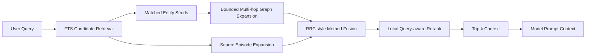

# Phase 6: Graph Retrieval Upgrade

Last updated: 2026-06-11 18:13 GMT+8

## Status

Phase 6 upgrades Connor's local graph retrieval path without changing the core product invariant: graph memory remains Connor's local-first kernel, not a normal RAG/source plugin and not state owned by a sidecar SDK.

The implementation keeps SQLite as the retrieval substrate and improves candidate generation, graph expansion, local reranking, and context explainability.

## Why

Production RAG systems increasingly fail at retrieval rather than generation. The practical 2026 pattern is hybrid retrieval with candidate expansion, reranking, citations, and measurable context precision. Connor's graph is more structured than document RAG, so retrieval must preserve graph semantics: entities, statements, episodes, source evidence, temporal validity, confidence, and neighborhood paths.

## Implemented

### 1. Retrieval controls

`GraphRerankingConfig` now carries Phase 6 retrieval controls:

- `graphExpansionDepth`
  - bounded to 0...4
  - default: 2
- `candidatePoolMultiplier`
  - bounded to 1...10
  - default: 3

These live inside `GraphRerankingConfig` rather than as extra top-level `GraphSearchQuery` fields to preserve stable query construction and keep retrieval strategy configuration together.

### 2. Larger candidate pool

`SQLiteGraphHybridSearchService` now retrieves an expanded candidate pool:

```text
perScopeLimit = query.limit × candidatePoolMultiplier
```

This supports production-style retrieve-broad → rerank-narrow behavior.

### 3. Multi-hop graph expansion

The old one-hop neighborhood expansion has been upgraded to bounded multi-hop expansion:

```text
seed entities → hop 1 statements → next frontier → hop 2 statements → ...
```

Each graph-neighborhood hit now includes:

- `graph_neighborhood_hop{n}_v2` retrieval method
- `graph_hop`
- `graph_expansion_depth`
- `graph_context_entity_ids`

This makes multi-hop graph context visible and auditable.

### 4. Local query-aware reranking

A local deterministic reranker now adds quality signals before final truncation:

- lexical overlap between query terms and hit title/text/entity endpoints
- statement endpoint context boost
- statement confidence boost
- episode mention boost when configured
- optional MMR diversity pass

Rerank explanations are persisted in hit metadata:

- `matched_terms`
- `lexical_overlap_count`
- `rerank_reasons`
- `retrieval_pipeline`
- `mmr_selected_rank` when MMR is used on a large enough candidate set

### 5. More explainable AgentContext

`AgentContext.renderedText` now includes each item's retrieval reason:

```text
Source: statement:...
Reason: matched via statement_fts_v3+graph_neighborhood_hop1_v2
...
```

This makes graph context more inspectable for prompt inspection, debugging, and future retrieval-quality evaluation.

## Current retrieval pipeline



## Guardrails

- No external vector database is introduced.
- No cloud reranker is introduced.
- No SDK sidecar owns graph retrieval state.
- Temporal and belief-status filters still apply.
- Graph writes remain governed by the graph admission pipeline.
- Retrieval stays deterministic and testable.

## Validation

Phase 6 adds/updates tests for:

- retrieval control bounds
- bounded multi-hop graph expansion
- local rerank explanations
- retrieval pipeline metadata
- AgentContext reason rendering
- existing FTS + graph-neighborhood + source-episode fusion behavior

Validation result:

- `swift test`: 283 tests passed
- `swift build`: build complete

## Next Slice Candidates

1. Retrieval evaluation harness
   - context precision / recall fixtures
   - golden query sets
   - regression reports
2. Embedding-backed semantic retrieval
   - local embedding table persistence
   - cosine retrieval over graph owners
   - hybrid FTS + semantic fusion
3. Cross-encoder adapter seam
   - local model or sidecar scorer
   - still Connor-owned, not SDK-owned state
4. Query decomposition
   - multi-question expansion for complex user prompts
   - retrieval budget control
5. Retrieval UI inspector
   - show hop paths, score contributions, confidence, source episodes
