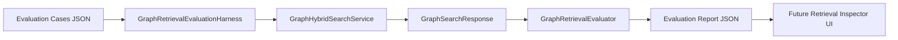

# Phase 7: Graph Retrieval Evaluation Harness

Last updated: 2026-06-11 18:36 GMT+8

## Status

Phase 7 adds a Connor-owned graph retrieval evaluation harness. It turns Phase 6's upgraded retrieval pipeline into something measurable, comparable, and regression-testable.

This phase intentionally does **not** introduce a cloud evaluation service, external vector database, or SDK-owned memory state. Evaluation manifests and reports are local Product OS state under the single Connor Home / Runtime Root.

## Why

Phase 6 improved graph retrieval with larger candidate pools, multi-hop expansion, source episode expansion, method fusion, and local reranking. The next commercial-grade step is not adding more retrieval tricks blindly; it is making retrieval quality observable.

Recent GraphRAG benchmarks emphasize that graph retrieval is not universally better than baseline RAG. It helps when queries need connected reasoning, hierarchical/contextual understanding, and source-grounded synthesis. Therefore Connor needs a local evaluation harness that can answer:

- Did a retrieval change improve or regress known golden queries?
- Are required graph facts present in top-k?
- Does multi-hop graph expansion actually retrieve bridge statements?
- Are source episodes and graph hits appearing at useful ranks?
- Can retrieval quality be inspected without delegating state ownership to a sidecar SDK?

## Implemented

### 1. Evaluation Manifest Model

New file:

- `Sources/ConnorGraphSearch/GraphRetrievalEvaluation.swift`

Core types:

- `GraphRetrievalJudgment`
- `GraphRetrievalEvaluationCase`
- `GraphRetrievalEvaluationHit`
- `GraphRetrievalEvaluationMetrics`
- `GraphRetrievalEvaluationCaseResult`
- `GraphRetrievalEvaluationReport`

An evaluation case is a JSON-codable golden query manifest:

```swift
GraphRetrievalEvaluationCase(
    id: "multi-hop-case",
    queryText: "who connects alice to carol",
    graphID: "default",
    centerEntityIDs: ["entity-alice"],
    reranking: GraphRerankingConfig(graphExpansionDepth: 2),
    judgments: [
        GraphRetrievalJudgment(
            ownerType: .statement,
            ownerID: "statement-bob-carol",
            relevance: 2,
            isRequired: true
        )
    ]
)
```

### 2. Metrics

`GraphRetrievalEvaluator` computes:

- Precision@k
- Recall@k
- HitRate@k
- Mean Reciprocal Rank
- Average Precision
- nDCG@k
- RequiredHitRate@k

The `required` judgment path is intentionally included because Connor needs product-grade guardrails: some facts are not merely relevant; they are required for a correct graph-memory answer.

### 3. Harness Runner

`GraphRetrievalEvaluationHarness` executes evaluation cases against any `GraphHybridSearchService`:

```swift
let harness = GraphRetrievalEvaluationHarness(searchService: service)
let report = try await harness.run(cases: cases, k: 10)
```

This keeps evaluation independent from SQLite while still exercising the same search protocol used by runtime retrieval.

### 4. Explainable Hits in Reports

Each evaluation hit captures:

- rank
- owner type / owner ID
- title
- score
- retrieval method
- source episode IDs
- matched terms
- rerank reasons
- graph hop

This is designed to support a future Retrieval Inspector UI without reworking the report format.

### 5. Product OS Local Persistence

New file:

- `Sources/ConnorGraphAppSupport/AppGraphRetrievalEvaluationRepository.swift`

Storage paths:

```text
graph/evaluations/retrieval-evaluation-cases.json
graph/evaluations/reports/*.json
```

The repository supports:

- loading/saving JSON evaluation cases
- validating duplicate case IDs
- validating duplicate judgments within a case
- rejecting empty judgment sets
- saving timestamped reports

This follows the existing single Home / Runtime Root rule and avoids any `workspace` path segment.

## Architecture



## Boundaries

Phase 7 is an evaluation harness, not an optimizer.

It does not yet:

- auto-tune reranking weights
- call LLM judges
- use cloud evaluation APIs
- introduce a vector database
- add a native UI panel
- change graph write governance

The harness is deliberately small, typed, JSON-persisted, and protocol-based so future phases can add UI, CI reports, or benchmark suites without changing the core retrieval runtime.

## Tests

New tests:

- `Tests/ConnorGraphSearchTests/GraphRetrievalEvaluationPhase7Tests.swift`
- `Tests/ConnorGraphAppSupportTests/AppGraphRetrievalEvaluationRepositoryPhase7Tests.swift`

Coverage:

- ranking metric computation
- required-hit coverage
- harness execution and summary aggregation
- JSON manifest round trip
- local Product OS persistence under `graph/evaluations`
- duplicate case rejection
- duplicate judgment rejection
- empty judgment rejection
- no `workspace` path segment in evaluation storage

## Validation

Validation after Phase 7 implementation:

- `swift test`: 288 tests passed
- `swift build`: build complete

## Next Slice Candidates

1. Retrieval Inspector UI
   - display golden cases
   - show top-k hits, graph hops, matched terms, rerank reasons
   - run evaluation from Product OS panel
2. CI / baseline comparison
   - compare current report against last blessed report
   - fail on required-hit regressions
3. Embedding-backed semantic retrieval
   - add local embedding retrieval as another candidate generator
   - evaluate FTS vs semantic vs graph fusion
4. Query decomposition evaluation
   - test complex multi-intent prompts
   - measure required-hit coverage across subqueries
5. LLM-as-judge adapter seam
   - optional local/sidecar faithfulness scorer
   - Connor still owns manifests, reports, and policy
